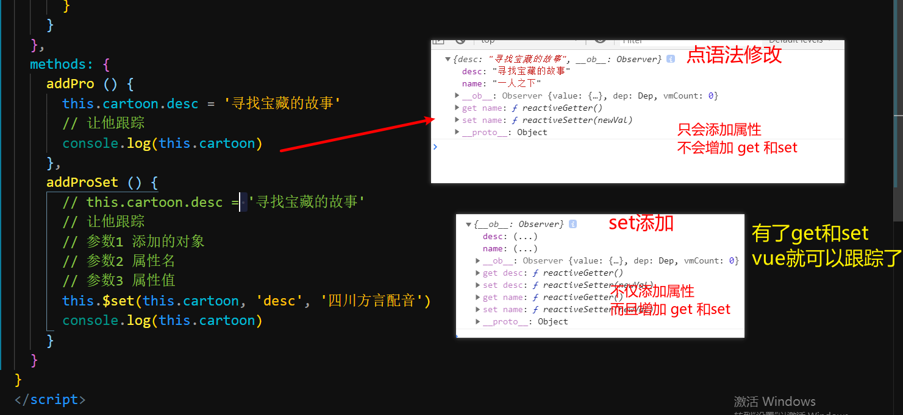
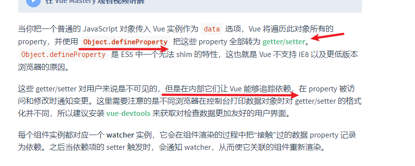
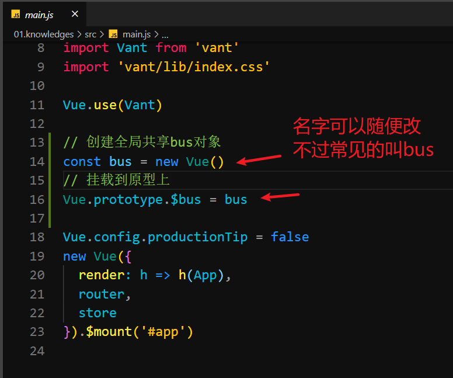
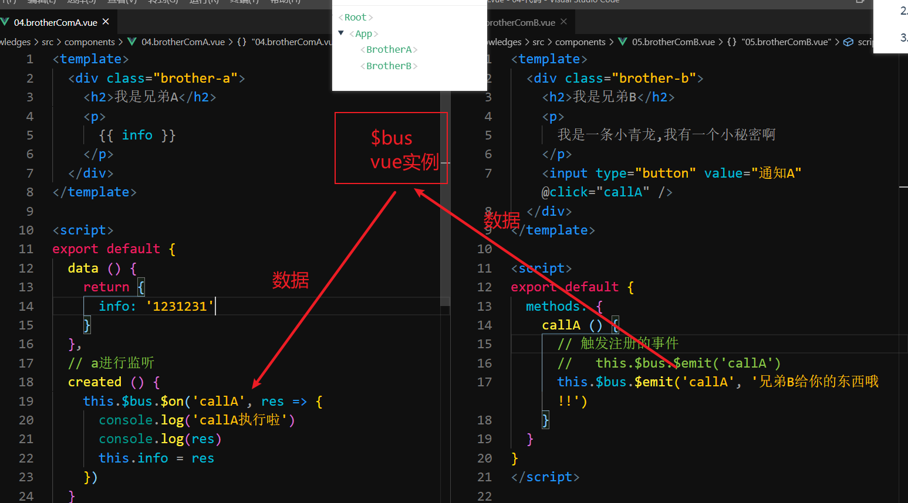

# day2-进阶

## 反馈

  1. 好像都会又好像都不会

2. 老师讲课通俗易懂，棒棒哒~

3. 不知其然也不知其所以然.. 上课第一天犯困打盹,哎哎, 听不太懂. 我把你说的那几个知识点记住大概就行了吗? 比如高版本转低版本的核心就是bable-loader加载 器,但是这些我都写不出来的哦

4. 老师细心，厉害，无敌。老师，我们vue该学的都学完了吗。把vue当做武器的话，我们现在修炼的武器是小刀还是重型大炮呀。。。。。。。。。。还有什么没有教我们的，老师快给我们说说。。

5. 能讲解下深度优先遍历和广度优先遍历的区别和如何实现吗？

   ~~~
   
   
   
   
   
   
   
   
   
   
   
   ~~~

   

6. 方方方方方

7. 狗彬彬

## 回顾


- ~~~js
   webpack
      1:npm init -y 初始化
      2:装包  npm i webpack webpack-cli@3.3.11 -D
      3:配制package.json
          scripts:{
            "build":"webpack --config vue.config.js"
          }
      4:webpack.config.js/vue.config.js
      const path=require("path")
         module.exports={
          // 入口
          entry:"入口文件js",
          output:{
            filename:"文件名[name][hash:8].js",
            path:path.join(__dirname,'dist')
          },
          mode:"production(压缩,没有注释,没有错误提示)/development",
          resolve:{
              alias:{
                  "@":path.join(__dirname,'src')
              },
              extensions:['.js','.css','.vue']
          },
          devtool:"inline-source-map/source-map",
          module:{
              rules:[
                  {
                      test:/\.css$/,
                      use:['style-loader','css-loader']
                  }
              ]
          },
          plugins:[new 插件名()]
         }
   
   
   
   
   
   
   
   
   
   
   
   
  

  ~~~
  
  
  


## 插件

> 给 webpack 提供额外的功能

### 插件 - HtmlWebpackPlugin

> 修改内容之后，重新打包好 dist 目录下的内容之后，还需要将 index.html 从根目录下拷贝到 dist 目录下，太麻烦了。
>
> 问题：我不希望每次重新打包 dist 目录之后再将 index.html 拷贝到 dist 目录下。
>
> 解决方案：可以使用 HtmlWebpackPlugin

作用：可以在 dist 目录中自动生成一个 html 文件

使用步骤：

+ 1.0 下载插件

  ```bash
  npm install --save-dev html-webpack-plugin
  ```

+ 2.0 配置插件（webpack.config.js 中完成的）

  ```js
  // 导入插件
  const HtmlWebpackPlugin = require('html-webpack-plugin')
  // 配置插件
  module.exports = {
      plugins: [
          new HtmlWebpackPlugin({           
              template: 'html模版文件路径' // 以谁为模板生成的静态页面
          })
      ]
  }
  ```

+ 3.0 重新打包: `npm run build`

注意点：

+ 如果不设置其它属性，默认会生成一个 html 文件
  + 这个文件中没有结构 & 样式
  + 它默认导入了生成的 js 文件

### 插件 - clean-webpack-plugin

> 每次重新打包项目时一定要删除 dist 目录
>
> 问题：每次都删除，太麻烦了。解决这个问题可以使用：clean-webpack-plugin

作用：用来清除 dist 目录

步骤：

+ 1.0 下载插件

  ```bash
  npm install clean-webpack-plugin --save-dev
  ```

+ 2.0 配置插件

  ```js
  // 导入插件
  const { CleanWebpackPlugin } = require('clean-webpack-plugin');
  // 配置插件
  module.exports = {
   	plugins:[
          new CleanWebpackPlugin()
      ]
  }
  ```

+ 3.0 重新打包

注意点：

+ 1.0 插件会帮助自动清除 dist 目录
+ 2.0 以后如果有能力看文档时，尽量用英文文档

### 插件 - webpack-dev-server

> 可以开启一个服务器，具有实时更新的功能

作用：可以开启一个服务器，具有实时更新的功能

步骤：

+ 1.0 下载插件

  ```bash
  npm install --save-dev webpack-dev-server
  ```

+ 2.0 配置插件（webpack.config.js）

  ```js
  module.exports = {
  	devServer: {
          proxy:{
              "/api":{
                  target:""
              }
          }
      //	contentBase: './dist'
  	},
  }
  ```

+ 3.0 配置指令：(package.json)

  ```json
  {
  	"scripts": {
  		"build": "webpack --config webpack.config.js",
  		"serve": "webpack-dev-server --config webpack.config.js --open"
  	}
  }
  ```

+ 4.0 开启服务器：`npm run serve`

注意点：

+ 开启服务器之后，修改完代码之后是不需要自己重新打包， 手动刷新页面的（服务器可以做到时实更新）

### 插件 - 模块的热替换

> 修改 css 之后，可以让页面不 刷新直接更新修改的样式

```js
module.exports = {
	devServer: {
    	port:"端口号",
        open:"自动打开true",
        host:"127.0.0.1"
    	hot: true, // 开启模块的热更新
	}
}
```

注意点：

+ 配置文件中的配置项发生修改之后需要重启服务才能生效

总结：

+ 插件的作用是给 webpack 提供额外的功能
+ 插件的种类不单单只有以上几种还有很多，详情请见： [传送门](https://www.webpackjs.com/plugins/)
+ webpack
  + 配置项：配置项目中的相关信息
  + loader：配置打包信息
  + plugin：配置额外功能


## 补充 

### 补充 - 准备工作

使用 `vue-cli` 来搭建一个项目结构

### 补充vuex

- `mapMutations`用法

  - ~~~js
    1:导入 import {mapMutations} from 'vuex'
    2:定义
       methods:{
       ...mapMutations(["setNum"])
        //   function setNum(value){
        //   this.$store.commit("setNum",value)
        //    }
       }
    ~~~

- `mapActions`用法

  - ~~~js
    1:导入  import {mapActions} from 'vuex'
    2:定义
       methods:{
          ...mapActions(["refreshNum"])  // this.refreshNum()
       }
    ~~~

- `map`方法/属性的重命名

  - ...mapState({新的名字:vuex中的名字})  
    - 如  ...mapState({xxx:'num'})   这里的xxx就代表着this.$store.state.num的值
  - 其它map也是如此

- modules中使用

  - state

    - ~~~js
      modules:{
      login:{
        state:{
        user:""   // this.$store.state.login.user有没有命名空间都是这样
        }
      }
      }
      ~~~

    - namespaced:true时map用法

      - 定义

        - ~~~
          computed:{
          ...mapState("命名空间的模块名(login)",['user'])
          }
          ~~~

  - mutations

    - 有namespaced使用

    - ~~~js
      modules:{
       login:{
          namespaced:true,
          state:{
          user:""
          },
          mutations:{
          setUser(state,value){
            state.user=value
          }
              // this.$store.commit("login/setUser",值)
          }
       }
      }
      ~~~

    - mapMutations使用

      - 定义

        - ~~~js
          methods:{
          ...mapMutations('命名空间的模块名(login)',['setUser']) // this.setUser(值)
          ...mapMutations(['login/setUser'])
          // this['login/setUser'](值)
          }
          ~~~

      - 

### Vue.set添加跟踪的属性

> 如果属性是动态添加的Vue默认无法跟踪改变,咋办呢?

数组只能识别长度变化 

对象:原本有的属性修改它能识别,新增属性不可以

[vm.$set](https://cn.vuejs.org/v2/api/#vm-set)

~~~
数组:修改后,它只能识别长度的变化,
对象:原有属性修改可以识别,新增属性不能识别
proxy特别对象处理方式
set作用:让不能识别到变化 的字段能够识别到(添加该属性的get与set处理)
在vue文件中的用法: this.$set(对象或者数组名,"key值,如果是数组就是索引",修改后的值)
 在js中的用法:Vue.set(对象或者数组名,"key值,如果是数组就是索引",修改后的值)
~~~


1. 如果属性默认在`data`或者`state`中不存在
2. 动态的添加上去,vue是不会跟踪的

```javascript
const obj ={}
obj.name="jack"
```


注意:

1. 如果添加本来不存在的属性,为了让vue跟踪到可以使用`this.$set`来添加


```javascript
// 参数1 添加的对象
// 参数2 属性名
// 参数3 属性值
this.$set(this.cartoon, 'desc', '四川方言配音')

```




**vue之所以能够跟踪数据变更01**



1. 设置到vue中的属性,vue会自动的为其添加`get/set`用来检测数据的改变
2. 内部使用的是`Object.defineProperty`这个`api`
3. 只有添加了`get和set`的属性改变时页面才会更新
4. 要动态的添加`this.$set`
5. 目前我们用的`2.x`版本的Vue只能兼容到`ie9`及以上之前的无法兼容


**静默刷新:**

1. 通过布尔值去切换元素的显示
2. 动态添加属性之后,修改布尔值`false`,`$nextTick(()=>{})`设置为`true`

```vue
<template>
  <div>
    app
    <input type="button" value="改name" @click="cartoon.name = '天线宝宝'" />
    <br />
    <input type="button" value="直接点语法添加属性" @click="addPro" />
    <!-- v-if修饰标签 -->
    <p v-if="isShow">动漫:{{ cartoon }}</p>
  </div>
</template>

<script>
export default {
  data () {
    return {
      // 标记是否显示的布尔值
      isShow: true,
      cartoon: {
        name: '一人之下'
      }
    }
  },
  methods: {
    addPro () {
      this.cartoon.desc = '寻找宝藏的故事'
      // 为了保证一定更新先隐藏
      this.isShow = false
      // 显示出来
      this.$nextTick(() => {
        this.isShow = true
      })
      // 让他跟踪
      console.log(this.cartoon)
    }
  }
}
</script>

<style></style>

```


### 补充 - 特性继承

> 在父组件中使用子组件时，如果给子组件传入一些非 props 属性，那么这些属性会作用到子组件的根元素上

`props` 属性：

+ 在组件使用过程中经常出现父组件给子组件传参， `props` 就是用来进行父传子的

非 `props`  属性：

+ 父组件给子组件传参时，子组件没有通过props接收的属性

### 补充 - inheritAttrs

>  取值  a. true：（默认）启用继承特性   b. false 禁用继承特性


### 补充 - $attrs与$listeners

>  里面包含了所有父组件在子组件上设置的非 `prop` 属性， 它是会通过`$attes`接收该信息的,`$listeners`它会接收所有的在子组件身上绑定的方法

~~~js
v-bind="$attrs"  //可以通过此方式将父组件传递的非props属性再传递孙组件
v-on="$listeners" //可以通过此方式将父组件传递的方法再传递给孙组件上
~~~


### 兄弟通讯 - eventBus

> 通过一个中间人实现数据的通讯,这个中间人就是一个`Vue`实例

[$on事件注册](https://cn.vuejs.org/v2/api/#vm-on)

[$emit事件触发](https://cn.vuejs.org/v2/api/#Vue-set)


实现步骤:

1. 创建一个可以全局都访问到的Vue实例对象
   1. 挂载到`prototype.$bus`上
2. 兄弟组件的`created`中通过`$bus`注册监听
3. 另外的兄弟组件中通过`$bus.$emit()`触发注册的事件





注意:

1. 全局共享可以使用`原型`实现

2. 需要通讯的组件都需要通过`$bus`干点事
   1. 注册
   2. 触发
3. 小型项目,没什么全局数据共享


### 跨级组件通讯 provide 和 inject

> 跨级通讯如何实现呢?

[vue-provide和inject](https://cn.vuejs.org/v2/api/#provide-inject)


传递数据的组件,一般是比较靠上的组件(层级)

```javascript
{
	provide(){
		return{
			name:'rose',
			info:this.xxx
		}
	}
}
```


接收数据的组件,最起码是子组件,甚至`孙子`

和祖先传递出来的`provide`中的属性同名

```javascript
{
	inject:['name','info'],
    created(){
        console.log(this.name)
    }
}
```


### 补充 - 组件间通信方式

+ `$ref` &  `$parent`

  + 父传子(父访问子实例对象(this))

    - 在子组件标签定义ref属性
    - this.$refs.ref值===子组件this

  + 子传父(子访问父的实例对象)

    + this.$parent===父组件的this

      ~~~
      app
          <van-button>
            <son></son>
         </van-button>
      son
         this.$parent===van-button的this
      ~~~

      

+ `props` & `$emit`

+ `eventbus`

  + 定义:中间信息中转站在`main.js`中定义一个`$bus`

    + ~~~vue
      Vue.prototype.$bus = new Vue()
      ~~~

  + 注册:在想接收相应信息的组件创建一个监听事件

    + ~~~
      //$on可以理解为监听某个事件,有人触发就执行后面方法,
      //第一个参数为事件名,第二个参数为接收到相应信息后的触发方法
      this.$bus.$on('message', (str) => {
          console.log(str)
      })
      ~~~

  + 触发:在想发送信息的组件通过`$emit`发送信息

    + ~~~js
      //$emit可以理解为发送相应的信息给某个事件,
      //第一个参数是事件名,第二个参数是触发相应事件时的参数
      this.$bus.$emit('message','传参给$on方法的str')
      ~~~

      

+ `vuex`

+ `$attrs` & `$listeners`

  + v-bind="$attrs" $attrs:非props属性
  + v-on="$listeners"

+ `provide`&`inject`

  + 高阶组件传值
  + 只能用于高等级组件传给低等级组件
    + provide的值不可修改
    + inject:的值(堆可以修改,栈不可修改),原始值不可修改,引用值只要不修改它的引用,它的值可以随便修改


### 补充 - 动态组件

>  Vue.js 提供了一个特殊的元素 <component> 用来动态地挂载不同的组件,使用 is 特性来选择要挂载的组件


### 补充 - 异步组件

>  在大型应用中，我们可能需要将应用分割成小一些的代码块，并且只在需要的时候才从服务器加载一个模块。 

回顾：

+ 项目的打包： `npm run build`
  + 项目根目录下生成一个 `dist` 文件夹
    + css：当前项目中所有打包后的样式文件
    + js：当前项目中所有打包后的 js 文件
      + app.js 所有 src 目录下内容打包后的结果
      + app.js.map：上面文件的映射文件
      + chunk.js：所有第三方包打包后的文件
      + chunk.js.map：上面文件的映射文件
    + index.html：项目的静态页面

问题：

+ 表现：打包之后的项目，运行之后，会一口气将当前项目中所有的文件全部加载出来
+ 响应：第一次加载页面时会非常慢，用户体验不好。
+ 解决方案：
  + 可以使用异步组件来解决这个问题

用法：

+ 同步组件（之前我们使用组件的方式就是同步组件）：
  + 导入方式：
    + `import login from './login.vue'`
  + 特点：
    + 在打包时，会一并打包到 `app.js` 中
    + 请求页面时，会随着 `app.js`  一并请求出来
+ 异步组件
  + 导入方式：
    + `const login = () => import './login.vue'`
  + 特点：
    + 在打包时，不会打包到 app.js 中，而是会单独打包为一个`js` 文件
    + 请求页面时，只要在请求到时，才会加载出来

注意点：

+ 如果用 vue 中的组件上，它的名称为：异步组件
+ 如果用在路由上，它的名称为：路由的懒加载

### 性能优化

vue的缺点:

1. 首次加载慢(首次打开少于3秒)
2. 最低用于ie9

- 2:路由懒加载
- 4:组件按需加载(异步组件)
- 7:cdn全局使用的js库,我们直接在index.html导入
  - 100个1M的文件与1个100M的文件同时下载
  - app.vue导入了moment.js,会将moment.js打包到app.js
- 6:图片精灵图(减少了服务器请求)
- 1:gzip压缩(服务器处理)
  - gzip就是压缩 了相应html,css,js
  - 前端压缩 
    - 支持的就使用gzip
    - 不支持使用原始的
  - 后端压缩
    - 后端处理
- 3:减少接口请求
  - 缓存组件
  - vuex存储用户信息
- 8:图片等资料压缩
  - ui会给一些图片你们,轮播图,50M  6张

### 