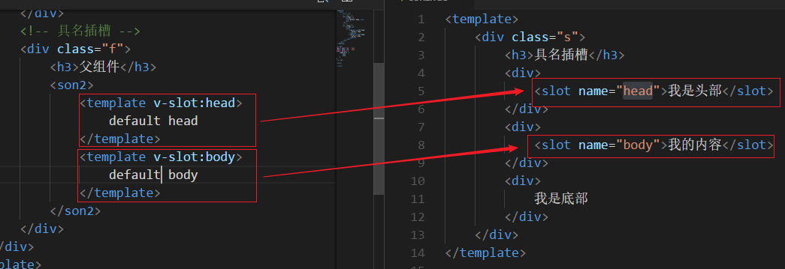
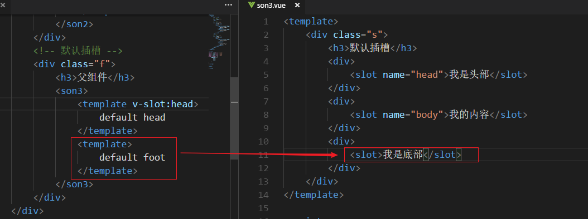
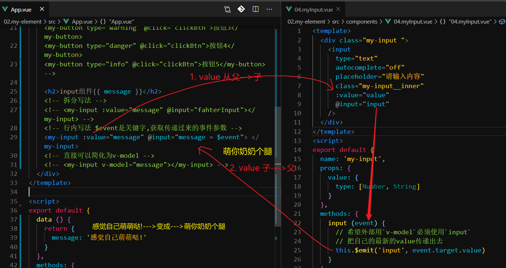

## 反馈

- 老师那些找到工资很高,你们有没有了解他们过了实习期吗,有没有一两个月被退掉的
  - 退掉只是很少数
    - react
    - 态度
      - 上下班时间
      - 对领导的话认可一下
      - 和同事相处好一点
        - 领导特别不喜欢
        - 你来这公司多久了
      - 一个月后
1. 老师，项目还有一个cancel的bug没处理哦。

1. webpack-dev-server模式自动刷新和热更新有点模糊，可以再复习一下吗？

   1.	devServer   默认热更新.(自动刷新)  hot:true

1. 今天又是懵懵哒!好难呀

1. 那些重点知识有些能记住，但是不知道该写哪里，怎么写什么时候写怎么办，回头一看是不怎么难，但是就是不会写

   1.	逻辑处理
   1.	传值处理
      1.	组件传值
      1.	路由传值
   1.	api处理

1. 老师，程序员最好的副业是什么？程序员真的要每天保持一直学习吗？感觉这样子，好累呀。

   1. 有目的.

   1. 工作做好.

      1.	移动端项目
         1.	不做组件封装
         1.	利用休息时间把这些代码重构

   1. 时刻准备做其它技术

      a:vue.

      b:小程序

      c:react

1. 移动端如何调用手机拍照功能，如何调用长按手机录音功能,

   1.	input   

1. ①老师，一般企业怎么看待培训机构出来的学生(或者说，怎么看待传智黑马出来的学生)？(要不要在简历写上传智黑马) 

   1.	做好工作.
   1.	不要看轻自己.
      1.	他比我强不到哪去
      1.	目标要高一点
         1.	一年内涨工资一万   3千

1. ②我可不可以不包装，我就实话实说，我是从传智黑马学完出来的，我会什么什么技术，没有开发经验，这样可以吗(因为不太会撒谎，怕兜不住，我一撒谎就漏洞百出...)？ 

1. ③到公司上班如果是用公司的电脑，写到某些知识点记不清了，我需要翻找我的笔记以及我的代码，我要怎么找我的东西呢，我可以通过带我的笔记本电脑去或者通过U盘、百度云来翻找我的笔记吗，还是只能百度呢？ 

   1.	能进不能出
   1.	不能上网的公司,邮箱(发邮件带文件进来,但是不能带文件出去)

1. ④最近每天上完课可以听老师讲职场故事真的很开心，谢谢你，鸣人。

1. 希望老师可以留下来继续教我们呀

1.	时间过得真快啊 转眼间就到了 临近毕业 毕业以后可没机会这么多人一起学习了.

## 回顾

组件传值

- ref与$parent

  - 父传子(父访问子组件的实例对象this)
    - 子组件标签上绑定一个ref ref=值
    - 父组件访问子组件this  this.$refs.ref值===子组件this
  - 子传父(子访问父的this)
    - this.$parent===父组件this

- props与$emit

  - 父传子(父传子属性)
    - 传:子组件标签上定义一个属性  属性名=值
    - 收:子组件内接收 
      -  props:['属性名']
      - props:{属性名:{type:类型,default:默认值(原始值直接写,引用值function(){return 引用值})}}
    - 注意点:原始值不可修改,引用值只要不修改它的引用,它的值随便修改
  - 子传父(子触发父方法)
    - 在子组件标签上绑定一个方法  @子组件方法名=父组件方法名
    - 子组件内触发  this.$emit("子组件方法名",参数)

- 兄弟组件传值bus

  - 在vue原型上加入$bus
    - Vue.prototype.$bus=new Vue()
  - 监听
    - this.$bus.$on(方法名,function(参数){})
  - 触发
    - this.$bus.$emit("方法名",参数值)
  - 关闭监听
    - this.$bus.$off("方法名")

- vuex

  - ~~~js
    new Vuex.Store({
    state:{
       userInfo:""
        // this.$store.state.userInfo
        /*
        mapState使用
        import {mapState} from 'vuex'
        computed:{
          ...mapState(["userInfo"])
          ...mapState({
          userInfo2:'userInfo'
          })
        }
        */ 
    },
    mutations:{
      setUserInfo(state,value){
         state.userInfo=value
      }
        /*
        this.$store.commit("setUserInfo",值)
        mapMutations
        import {mapMutations} from 'vuex'
        methods:{
        ...mapMutations(['setUserInfo']),
        ...mapMutations({
        setUserInfo2:"setUserInfo"
        }),
        this.setUserInfo2(值)
        
        }
        */ 
    },
    actions:{
        refreshUserInfo(store,value){
            setTimeout(()=>{
              store.commit('setUserInfo',值)  
            },1000)
        }
        /*
        this.$store.dispatch("refreshUserInfo",值)
         methods:{
        ...mapActions(['refreshUserInfo']),
        ...mapActions({
        refreshUserInfo2:"refreshUserInfo"
        }),
        */ 
    },
    getters:{
        // 使用场景:依赖一个或者多个值产生一个新的值
        // 特点:它产的值会缓存起来,依赖的值改变了,它会立马改变,它产生的值可以当属性使用
        getUserInfo(state){
            return (num)=>{
              return  state.userInfo+num
            }
        }  
        // this.$store.getters.getUserInfo(123)===state.userInfo+123
      },
     modules:{
         login:{
             namespaced:true
             state:{
                 xxx:"123"
             // this.$store.state.login.xxx
             /*
             import {mapState} from 'vuex'
             computed:{
             ...mapState('login',['xxx'])
             ...mapState('login',{
             xxx2:"xxx"
             })
             }
             */ 
             },
             mutaiotns:{
                 setXxx(state,value){
                     state.xxx=value
                 }
                 不加命名空间和以前一样
                 加命名空间和以前一样:this.$store.commit("login/setXxx",参数值)
                  /*
             import {mapMutations} from 'vuex'
             methods:{
             ...mapMutations('login',['setXxx'])
             ...mapMutations('login',{
             setXxx2:"setXxx"
             })
             ...mapMutations(["login/setXxx"])
             ...mapMutations({
             setxxx3:"login/setXxx"
             })
             this["login/setXxx"]
             }
             */ 
             }
         }
     }
    })
    
    
    
    
    
    
    
    ~~~

- 特性继承

  - 非props属性会加入到$attrs
  - 所有方法会加入$listeners
  - 传给后代组件
    - 后代组件标签  v-on="$listeners" v-bind="$attrs"

- provide与inject

  - 高等级组件传值低等级组件

  - 传:

    - ~~~
      provide(){
      return {
        名字:值(可以访问data与methods),
        obj:{a:123}, 不可双向绑定
        obj:this.obj2 这种写法可双向
        obj:this   这种写法可双向
      }
      }
      data(){
      return obj2:{
      a:123
      }
      }
      ~~~

  - 收:

    - ~~~
      inject:["obj"]
      inject:{
      obj2:{
         from:"obj",
         default:function(){
         return {}
         }
      }
      }
      ~~~

  - 动态组件

    - ~~~
      component :is="xxx"  xxx=sona
      sona/sonb
      components:{
        sona:()=>import("路径"),
        sonb:()=>import("路径")
      }
      ~~~

    - 


## 取消报错统一处理

~~~js
axios.interceptors.response.use(
    function (res) {
        if (res.data.code === 200) {
            return res
        } else {
            return Promise.reject(new Error(res.data.message))
        }
    },
    function (err) {
        return Promise.reject(err)
    }
)
function _ajax (config) {
    return new Promise((resolve, reject) => {
        // resolve(123)
        // reject(new Error('123'))
        axios(config)
            .then(res => {
            resolve(res)
        })
            .catch(err => {
            window.console.log(err)
            // reject(err)
        })
    })
}
_ajax({
    url: 'http://localhost:1337/au/login',
    method: 'post',
    data: {
        mobile: '13666666666',
        code: '1111'
    }
}).then(res => {
    window.console.log(res)
})
~~~


## 组件

### 补充 - 动态组件

>  Vue.js 提供了一个特殊的元素 <component> 用来动态地挂载不同的组件,使用 is 特性来选择要挂载的组件


### 补充 - 异步组件

>  在大型应用中，我们可能需要将应用分割成小一些的代码块，并且只在需要的时候才从服务器加载一个模块。 

回顾：

+ 项目的打包： `npm run build`
  + 项目根目录下生成一个 `dist` 文件夹
    + css：当前项目中所有打包后的样式文件
    + js：当前项目中所有打包后的 js 文件
      + app.js 所有 src 目录下内容打包后的结果
      + app.js.map：上面文件的映射文件
      + chunk.js：所有第三方包打包后的文件
      + chunk.js.map：上面文件的映射文件
    + index.html：项目的静态页面

问题：

+ 表现：打包之后的项目，运行之后，会一口气将当前项目中所有的文件全部加载出来
+ 响应：第一次加载页面时会非常慢，用户体验不好。
+ 解决方案：
  + 可以使用异步组件来解决这个问题

用法：

+ 同步组件（之前我们使用组件的方式就是同步组件）：
  + 导入方式：
    + `import login from './login.vue'`
  + 特点：
    + 在打包时，会一并打包到 `app.js` 中
    + 请求页面时，会随着 `app.js`  一并请求出来
+ 异步组件
  + 导入方式：
    + `const login = () => import './login.vue'`
  + 特点：
    + 在打包时，不会打包到 app.js 中，而是会单独打包为一个`js` 文件
    + 请求页面时，只要在请求到时，才会加载出来

注意点：

+ 如果用 vue 中的组件上，它的名称为：异步组件
+ 如果用在路由上，它的名称为：路由的懒加载

### 性能优化

- gzip压缩(服务器处理)   
  - 全后端 处理
    - 如果前端支持,后端 就把文件进行gzip压缩 ,给前端gzip文件
    - 如果前端不支持,后端 就给js文件
  - 前端 与后端 结合
    - 前端:压缩文件成gzip是前端 来做,(js/gzip)
    - 后端根据情况给浏览器相应文件,支持就给gzip不支持就给js
- 路由懒加载(用到才加载,打包时将文件分解成多个)   
  - 不使用路由懒加载:全部都会加载成一个js(app.js)  ,造成第一次打开网站特别慢
  - 使用路由懒加载:路由懒加载(app.js     login.js    home.js),
  - App.vue
    - vuex  router(一堆文件)  插件 全局vant
- 组件按需加载(用到才加载)
- cdn全局使用的js库,我们直接在index.html导入
  - import jquery  from 'jquery'
  - cdn   使用在线地址
- 图片精灵图    
- 减少http(接口)请求(userInfo:Vuex,取消接口请求)
  - 特别是一些服务器请求很慢的接口
  - 请求接口需要十多秒(一个人的请求就可以让服务器cpu)
    - 十几亿数据
    - 8秒
  - 前端请求后,存储在本地的(localStorage:时间限制 (12小时内))
- 图片等资料压缩 
  - ui:图片(5M,20M)
  - 工具压缩

vue有什么缺点

- 单页面(App.vue)应用
  - 打开首页会慢(加载东西多了)
    - 打开子页面会快
- 不利于seo(seo读取html,谷歌的seo可以读取js)
  - ssr渲染   
    - 服务端会发送一个html页面给你
    - 后端做部分前端的事情 
    - 专业人事来调用seo
    - 汽车官网
      - jquery
      - vue srr
- 生命周期
  - 用自己的话语总结出来
- 性能优化
- 组件传值

### 

## 补充 - 插槽

> 概念：在父组件中，使用子组件时，子组件中的内容可能是固定的。但是有时候又需要将子组件中固定的内容进行替换。就可以使用插槽。

+ ~~~\
  默认插槽
  组件内:<slot></slot>
  
  使用组件:
     template #default
     div
  具名插槽
   组件内:<slot name="xxx"></slot>   
   使用组件:
     template #xxx   v-slot:xxx
  作用域插槽
     默认插槽
       组件内:<slot :abc="123456"></slot>
     使用组件:
     template v-slot="scope" scope.abc=123456
     具名插槽
     组件内:<slot name="xxx" abc="123456"></slot>   
      使用组件:
     template v-slot:xxx="scope" scope.abc=123456
    el-table
    自定义列  slot-scope="scope"   v-slot="scope"
  
  ~~~

+ 

+ 

+ 

+ 基本使用

  + 在子组件中设置插槽

    ```html
    <div>
        我是头部
    </div>
    <div>
        <slot>我的内容</slot>
    </div>
    <div>
        我是底部
    </div>
    ```

  + 在父组件中替换插槽中的内容

    ```html
    <son>default body</son>
    ```

    

+ 具名插槽

  > 如果一个组件内部有多个需要被替换的部分，可以使用具名插槽

  

+ 默认插槽

  > 如果不给插槽设置 name 属性，那么将父组件中的默认内容就是用来替换这个不设置 name 属性的内容

  

+ 作用域插槽

  > 如果希望在父组件中的插槽中使用到子组件中对应插槽的数据源，可以使用作用域插槽（子组件 slot 中用到的数组中可以传给父组件来使用）

  


## 补充:计算属性传参

- 计算属性:

  - 使用场景:依赖一个或者多个值产生的一个新的值

    - 特点:可以当属性使用,不可修改,它会缓存它的值

    - ~~~
      computed:{
         方法名(){
            return 值
         },
         方法名:{
          get(){
          return 值
          },
          set(value){
             .....
          }
         }
         this.方法名 ====return的值
         this.方法名=值
      }
      ~~~

- 计算属性传参

     1:将计算属性return的值变成一个function 该function可以接收参数

  ​       xxxset () {  

  ​          return (参数) => {

  ​            return this.xxx + 参数

  ​          }

  ​        }

     2:使用时:计算属性名(参数) 这样它就可以调用计算属性内return的function并传递参数

  ​      {{ xxxset(参数) }}
  
- 计算属性与watch与filters有什么区别

     - 计算属性:依赖一个或者多个值产生新的值,产生的新值会缓存起来
     - 侦听器:观察一个值变化 ,它就是某个值的change事件
     - 过滤器:this都不能用(只是用于字符加工)


## 需求 - 按钮

> 按钮组件也非常常见,咱们来实现一个

[Element-button](https://element.eleme.cn/#/zh-CN/component/button)

**需求:**

1. 实现`Element`中按钮的功能


**属性:**

| 参数     | 说明     | 类型    |               可选值                | 默认值 |
| -------- | -------- | ------- | :---------------------------------: | :----: |
| type     | 按钮类型 | string  | primary/success/warning/danger/info |   -    |
| disabled | 是否禁用 | boolean |                  -                  | false  |

**事件:**

| 事件名 | 说明     | 事件参数     |
| ------ | -------- | ------------ |
| click  | 点击事件 | 原生事件参数 |

**插槽:**

| 插槽名  | 说明     |
| ------- | -------- |
| default | 文本区域 |

**基本结构:**

```vue
<template>
  <button type="button" class="my-button my-button--primary is-disabled">
    <span>默认按钮</span>
  </button>
</template>

<script>
export default {}
</script>

<style lang="less">
.my-button {
  display: inline-block;
  line-height: 1;
  white-space: nowrap;
  cursor: pointer;
  background: #fff;
  border: 1px solid #dcdfe6;
  color: #606266;
  -webkit-appearance: none;
  text-align: center;
  box-sizing: border-box;
  outline: none;
  margin: 0;
  transition: 0.1s;
  font-weight: 500;
  -moz-user-select: none;
  -webkit-user-select: none;
  -ms-user-select: none;
  padding: 12px 20px;
  font-size: 14px;
  border-radius: 4px;

  &:focus,
  &:hover {
    color: #409eff;
    border-color: #c6e2ff;
    background-color: #ecf5ff;
  }
  // 禁用状态
  &.is-disabled,
  :hover.is-disabled {
    color: #c0c4cc;
    cursor: not-allowed;
    background-image: none;
    background-color: #fff;
    border-color: #ebeef5;
  }
  // 朴素按钮的状态
  &.is-plain:hover {
    background: #fff;
    border-color: #409eff;
    color: #409eff;
    &.is-disabled {
      color: #c0c4cc;
      cursor: not-allowed;
      background-image: none;
      background-color: #fff;
      border-color: #ebeef5;
    }
  }
  // 主要按钮的样式
  &.my-button--primary {
    color: #fff;
    background-color: #409eff;
    border-color: #409eff;
    // hover状态
    &:hover {
      background: #66b1ff;
      border-color: #66b1ff;
      color: #fff;
    }
    // 禁用状态
    &.is-disabled {
      color: #fff;
      background-color: #a0cfff;
      border-color: #a0cfff;
    }
    // 朴素状态
    &.is-plain {
      color: #409eff;
      background: #ecf5ff;
      border-color: #b3d8ff;
      &:hover {
        background: #409eff;
        border-color: #409eff;
        color: #fff;
      }
      &.is-disabled {
        color: #8cc5ff;
        background-color: #ecf5ff;
        border-color: #d9ecff;
      }
    }
  }
  // 成功按钮的样式
  &.my-button--success {
    color: #fff;
    background-color: #67c23a;
    border-color: #67c23a;
    // hover状态
    &:hover {
      background: #85ce61;
      border-color: #85ce61;
      color: #fff;
    }
    &.is-disabled {
      color: #fff;
      background-color: #b3e19d;
      border-color: #b3e19d;
    }
    // 朴素状态
    &.is-plain {
      color: #67c23a;
      background: #f0f9eb;
      border-color: #c2e7b0;
      &:hover {
        background: #67c23a;
        border-color: #67c23a;
        color: #fff;
      }
      &.is-disabled {
        color: #a4da89;
        background-color: #f0f9eb;
        border-color: #e1f3d8;
      }
    }
  }
  // 信息按钮的样式
  &.my-button--info {
    color: #fff;
    background-color: #909399;
    border-color: #909399;
    &:hover {
      background: #a6a9ad;
      border-color: #a6a9ad;
      color: #fff;
    }
    &.is-disabled {
      color: #fff;
      background-color: #c8c9cc;
      border-color: #c8c9cc;
    }
    // 朴素状态
    &.is-plain {
      color: #909399;
      background: #f4f4f5;
      border-color: #d3d4d6;
      &:hover {
        background: #909399;
        border-color: #909399;
        color: #fff;
      }
      &.is-disabled {
        color: #bcbec2;
        background-color: #f4f4f5;
        border-color: #e9e9eb;
      }
    }
  }
  // 警告按钮的样式
  &.my-button--warning {
    color: #fff;
    background-color: #e6a23c;
    border-color: #e6a23c;
    &:hover {
      background: #ebb563;
      border-color: #ebb563;
      color: #fff;
    }
    &.is-disabled {
      color: #fff;
      background-color: #f3d19e;
      border-color: #f3d19e;
    }
    // 朴素状态
    &.is-plain {
      color: #e6a23c;
      background: #fdf6ec;
      border-color: #f5dab1;
      &:hover {
        color: #e6a23c;
        background: #fdf6ec;
        border-color: #f5dab1;
      }
      &.is-disabled {
        color: #f0c78a;
        background-color: #fdf6ec;
        border-color: #faecd8;
      }
    }
  }
  // 危险按钮的样式
  &.my-button--danger {
    color: #fff;
    background-color: #f56c6c;
    border-color: #f56c6c;
    &:hover {
      background: #f78989;
      border-color: #f78989;
      color: #fff;
    }
    &.is-disabled {
      color: #fff;
      background-color: #fab6b6;
      border-color: #fab6b6;
    }
    // 朴素状态
    &.is-plain {
      color: #f56c6c;
      background: #fef0f0;
      border-color: #fbc4c4;
      &:hover {
        background: #f56c6c;
        border-color: #f56c6c;
        color: #fff;
      }
      &.is-disabled {
        color: #f9a7a7;
        background-color: #fef0f0;
        border-color: #fde2e2;
      }
    }
  }

  // 圆角按钮
  &.is-round {
    border-radius: 20px;
    padding: 12px 23px;
  }

  // 兄弟的间隙
  & + .my-button {
    margin-left: 10px;
  }
}
</style>

```


### 实现 - 按钮 - 属性

> 咱们先来实现属性部分的内容

实现步骤:

1. `disabled`是原生属性,建议直接从外部传入,不需要`props`
2. `props`中定义`type`
   1. validator
3. 和之前的实现方式基本一致


注意:

1. `$attrs`可以获取到所有非`props`的属性
2. 是一个对象
3. `disabled`传入时,如果没有赋值,默认是`空字符换`
4. 绑定`is-disabled`类名时,用了逻辑短路运算
   1. `表达式1  || 表达式2`
   2. 表达式1如果为true,直接返回
   3. 表达式1如果为false,就会继续解析表达式2
5. 可读性好--->逼格低
6. 逼格高---->可读性低
   1. 日常编码中,建议`可读性高`
   2. 抽取的功能模块中,建议`逼格高`


**直接行内表达式写**

```vue
<template>
  <button
    type="button"
    class="my-button "
    :class="[
      `my-button--${type}`,
      { 'is-disabled': $attrs.disabled === '' || $attrs.disabled }
    ]"
  >
    <span>默认按钮</span>
  </button>
</template>

<script>
export default {
  name: 'my-button',
  created () {
    // 是一个对象 保存了外部传入的 非props的值
    console.log(this.$attrs)
    // 有这个属性,直接取值,没有这个属性 underfined
    console.log(this.$attrs.disabled)
  },
  props: {
    // 类型
    type: {
      type: String,
      validator (value) {
        const arr = ['primary', 'success', 'warning', 'danger', 'info']
        return arr.indexOf(value) !== -1
      }
    }
  }
}
</script>


```


### 实现 - 按钮 - 事件

> 接下来咱们来实现按钮的事件部分

实现步骤:

1. 父组件要能够绑定事件
2. 组件内部必须通过`this.$emit`触发对应的事件
3. 内部绑定一个`click`
   1. 直接通知父组件即可


注意:

1. 子组件内部检测的是`click`这里不能乱写
2. 通过`emit`通知父组件时,事件名可以自定义,只要有意义即可
3. 基本功能类组件建议使用和原生事件同名的命名
   1. 按钮的点击事件`click`


### 实现 - 按钮 - 插槽

> 最后我们把插槽部分的内容整合进来

实现步骤:

1. slot

   

### 知识点 - 原生事件

> 对于`html`标签的原生属性,`vue`内部也会帮我们处理一下,

[原生事件绑定](https://cn.vuejs.org/v2/guide/components-custom-events.html#%E5%B0%86%E5%8E%9F%E7%94%9F%E4%BA%8B%E4%BB%B6%E7%BB%91%E5%AE%9A%E5%88%B0%E7%BB%84%E4%BB%B6)

注意:

1. 使用这种写法直接出发父组件传递进来的逻辑
2. 我们不再需要在`methods`中定义内容了进一步简化编码


### 调整 - 按钮 - 原生事件绑定

> 点击事件是原生事件,我们还要那么麻烦的触发


步骤:

1. 通过`$listeners`获取传入的`click`

自己内部定义了`methods`

```vue
<template>
  <button
    type="button"
    class="my-button "
    :class="[`my-button--${type}`, { 'is-disabled': showDisabled }]"
    @click="myBtnClick"
  >
    <span>
      <slot></slot>
    </span>
  </button>
</template>

<script>
export default {
  name: 'my-button',
  created () {
    // 是一个对象 保存了外部传入的 非props的值
    console.log(this.$attrs)
    // 有这个属性,直接取值,没有这个属性 underfined
    console.log(this.$attrs.disabled)
  },
  // 方法
  methods: {
    myBtnClick (event) {
      // console.log('子组件内部的点击事件触发啦!!')
      // console.log('event:', event)
      // 通知
      this.$emit('click', event)
    }
  },
  // 计算属性
  computed: {
    // 根据传入的disabled 设置isdisabled是否生效
    showDisabled () {
      if (this.$attrs.disabled === '') {
        return true
      } else {
        return this.$attrs.disabled
      }
    }
  },
  props: {
    // 类型
    type: {
      type: String,
      validator (value) {
        const arr = ['primary', 'success', 'warning', 'danger', 'info']
        return arr.indexOf(value) !== -1
      }
    }
  }
}
</script>

```


## 组件之v-model

>[https://cn.vuejs.org/v2/guide/components-custom-events.html#%E8%87%AA%E5%AE%9A%E4%B9%89%E7%BB%84%E4%BB%B6%E7%9A%84-v-model](https://cn.vuejs.org/v2/guide/components-custom-events.html#%E8%87%AA%E5%AE%9A%E4%B9%89%E7%BB%84%E4%BB%B6%E7%9A%84-v-model)

-  v-model`实际就是`props`与`emit`的语法糖(只针对父组件的`props`与`emit`写法简化)
  
-  要求:
  
  1. props传值属性名一定要是value 
  
  2. 绑定的方法一定要是@input方法,该方法一定只做了一件事,接收一个参数,修改value对应的值为该参数
  
      该二步满足条件就可以使用v-model="value对应的值"做一个减化(只是减化父组件写法)
  
-  props传值的value与@input对应的值都可以通过配制修改
  
     -  ~~~js
        model:{
            prop:"value(默认值)",
            event:"input(默认值)"
        }
        ~~~
  
     -  
  
     **父组件**
  
     ~~~vue
     <template>
       <div>
         <pre>
            需求:有一个组件能够生成随机数,父组件能修改它,子组件内部有个按钮也能修改它
            v-model实际就是props与emit的语法糖(只针对父组件的props与emit写法减化)
              要求:
                1:props传值一定要是value 
                2:绑定的方法一定要是@input方法,该方法一定只做了一件事,接收一个参数,修改value对应的值为该参数
                该二步可以使用v-model="value对应的值"做一个减化
                 
        </pre
         >
         <!-- <randomNum :value="valueNum" @input="inputEvent"></randomNum> -->
         <randomNum v-model="valueNum"></randomNum>
       </div>
     </template>
     <script>
     import randomNum from './10/randomNum'
     export default {
       components: {
         randomNum
       },
       data () {
         return {
           valueNum: 4321
       }
       },
     methods: {
         // inputEvent (num) {
         //   this.valueNum = num
         // }
       }
     }
     </script>
     <style></style>
     
     ~~~
  
     **子组件`randomNum`**
  
  ~~~vue
  <template>
    <div>
      <div>{{ value }}</div>
      <button @click="setNum">修改随机数</button>
    </div>
  </template>
  <script>
export default {
    props: ['value'],
  methods: {
      setNum () {
        this.$emit('input', Math.ceil(Math.random() * 999))
      }
    }
  }
  </script>
  <style></style>
  
  ~~~
  
  
  
  

## 需求 - 输入框组件

> 接下来我们通过输入框组件来巩固双向数据绑定数据

[自定义组件的v-model](https://cn.vuejs.org/v2/guide/components-custom-events.html#%E8%87%AA%E5%AE%9A%E4%B9%89%E7%BB%84%E4%BB%B6%E7%9A%84-v-model)


注意:

1. `v-model`本质是
   1. :value绑定value值
   2. @input绑定事件,事件中修改data中的值


**结构:**

```html
<template>
  <div class="my-input ">
    <input
      type="text"
      autocomplete="off"
      placeholder="请输入内容"
      class="my-input__inner"
    />
  </div>
</template>
```


**样式:**

```html
<style lang="less">
  .my-input {
    width: 180px;
    position: relative;
    font-size: 14px;
    display: inline-block;
    // width: 100%;
    &.my-input-password {
      .my-input__inner {
        padding-right: 30px;
      }
    }
    .my-input__inner {
      -webkit-appearance: none;
      cursor: pointer;
      background-color: #fff;
      background-image: none;
      border-radius: 4px;
      border: 1px solid #dcdfe6;
      box-sizing: border-box;
      color: #606266;
      display: inline-block;
      font-size: inherit;
      height: 40px;
      line-height: 40px;
      outline: none;
      padding: 0 15px;
      transition: border-color 0.2s cubic-bezier(0.645, 0.045, 0.355, 1);
      width: 100%;
    }
    &.is-disabled .my-input__inner {
      background-color: #f5f7fa;
      border-color: #e4e7ed;
      color: #c0c4cc;
      cursor: not-allowed;
      // placeholder兼容样式处理
      &::-webkit-input-placeholder {
        color: #c0c4cc;
      }
      &::-moz-input-placeholder {
        color: #c0c4cc;
      }
      &::-ms-input-placeholder {
        color: #c0c4cc;
      }
    }
    .iconfont {
      position: absolute;
      height: 100%;
      right: 5px;
      top: 0;
      text-align: center;
      color: #c0c4cc;
      transition: all 0.3s;
      line-height: 40px;
    }
  }
</style>
```


**参数:**

| 参数        | 说明           | 类型          | 可选值 | 默认值 |
| ----------- | -------------- | ------------- | ------ | ------ |
| v-model     | 双向绑定的数据 | string/number | -      | -      |
| placeholder | 输入框占位文本 | string        | -      | -      |

**事件:**

| 事件名 | 说明         | 参数     |
| ------ | ------------ | -------- |
| blur   | 失去焦点触发 | 事件参数 |
| focus  | 获得焦点触发 | 事件参数 |


### 实现 - 输入框 - v-model

> 咱们先来实现输入框的`v-model`

[$event 监听子组件的参数](https://cn.vuejs.org/v2/guide/components.html#%E4%BD%BF%E7%94%A8%E4%BA%8B%E4%BB%B6%E6%8A%9B%E5%87%BA%E4%B8%80%E4%B8%AA%E5%80%BC)

实现步骤:

1. props中定义`value`属性从外部传入
2. 子组件的内部响应`input`时间,通知父组件`$emit(input)`
3. type来限制类型
   1. 可以通过数组来设置多个类型


```vue
<template>
  <div class="my-input ">
    <input
      type="text"
      autocomplete="off"
      placeholder="请输入内容"
      class="my-input__inner"
      :value="value"
      @input="input"
    />
  </div>
</template>
<script>
export default {
  name: 'my-input',
  props: {
    value: {
      type: [Number, String]
    }
  },
  methods: {
    input (event) {
      // 希望外部用`v-model`必须使用`input`
      // 把自己的最新的value传递出去
      this.$emit('input', event.target.value)
    }
  }
}
</script>
```



注意:

1. 行内如果要获取参数可以使用`$event`来获取

2. 只要满足v-model的2个条件就可以简化为`v-model`

3. 面试问及`v-model`

   1. 本质就是value的绑定,input事件的绑定

   

### 实现 - 输入框 - 属性

> 接下来我们来实现属性部分的功能


1. props定义值
2. 接收外部传入的值
3. 在组件中使用即可


### 实现 - 输入框 - 事件

> 最后我们来实现输入框事件部分的内容

实现步骤:

1. 内部绑定事件
2. `$emit('事件名',参数)`即可


## .sync基本使用

> .sync是props传值时的一个修饰符,经过它修饰的值,子组件可以通过emit修改(没有原始值与引用值的限制 )

props传值通过.sync修饰

- ~~~
  <xxx  :aaa.sync="aaaFather"  />  aaaFather需要在data中定义
  ~~~

子组件通过emit修改传值(实际相当于修改了父组件的aaaFather的值)

- ~~~
  this.$emit("update:aaa",新的值)
  ~~~

## mixin

>混入:合体(二个组件组合在一起来)

全局使用

- Vue.mixin(对象)

  - 对象就可以理解 成我们组件内的script

  - ~~~
    {
    data(){
      return{
      xxx:123
      }
    },
    create(){
    console.log(123)
    }
    }
    ~~~

  - App.vue混入xxx  生成一个新的App.vue,一定是先混入的组件的生命周期(xxx)

局部混入

- 组件内:mixins:[导入的混入js],混入组件的所有生命周期都是在当前组件之前执行

  ~~~js
  import 名字 from '路径'
  export  default {
    mixins:[名字]
  }
  ~~~

  

## 补充 - 双向绑定的原理

基本概念：

+ 当视图上的数据发生改变时， data 中的数据也发生改变
+ 当 data 中的数据发生改变时，视图中的数据也发生改变

原理：

+ 主流使用的版本 2.x：

  + 关键字：`Object.defineProperty`

    ```js
    var data = {}
    document.querySelector('#ipt').oninput = function(e) {
    	data.name = e.target.value
    }
    Object.defineProperty(data, 'name', {
    	set: function(value) {
    		this._name = value
    		document.querySelector('#box').innerHTML = value
            document.querySelector('#ipt').value = value
    	},
    	get: function() {
    		return this._name
    	}
    })
    ```

+ 最新的版本 3.x

  + 关键字： `Proxy`

  + 用法

    + ~~~js
      返回值(proxy实例对象)=new Proxy(对象,{
      get(target,key){
      	return target[key]
      },
      set(target,key,value){
      	target[key=value]	
      }
      })
      ~~~

    + 

+ 注意点：

  + 我们这里讲的实现原理是实现的方法，其实在 vue 底层实现这玩意儿的时候用到一种模式：观察者模式。

