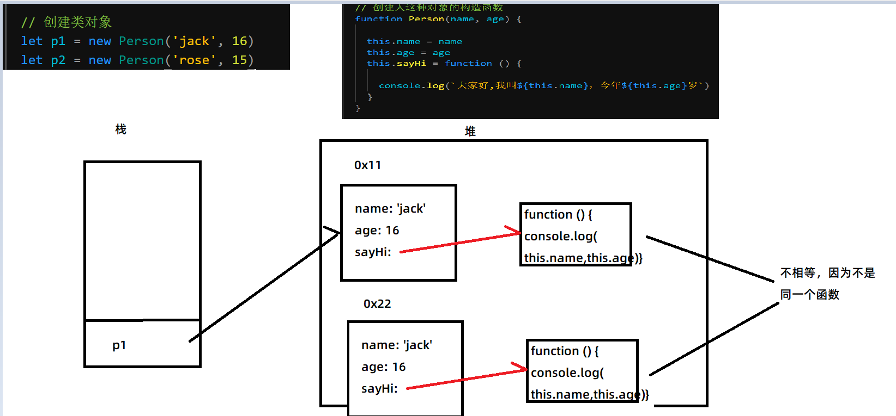
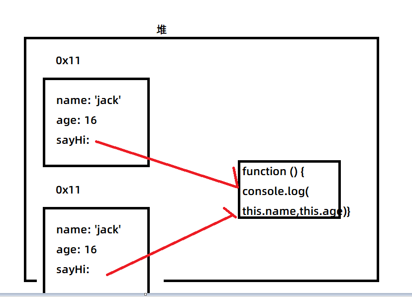
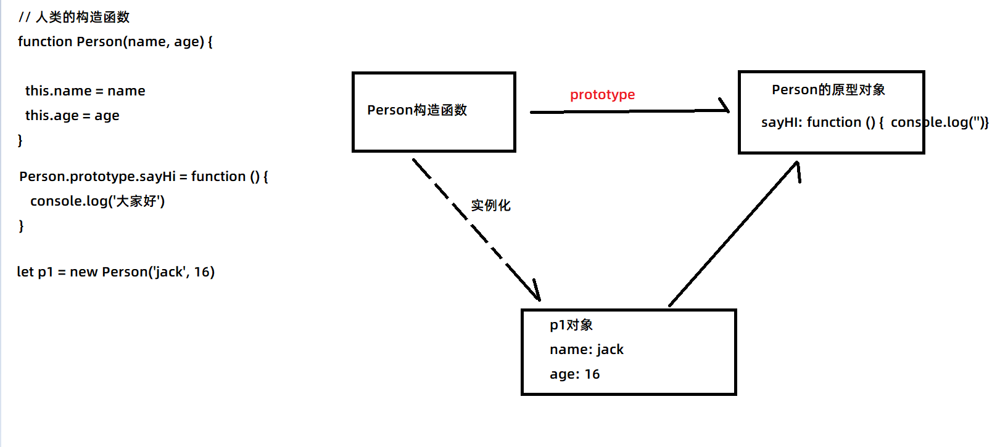
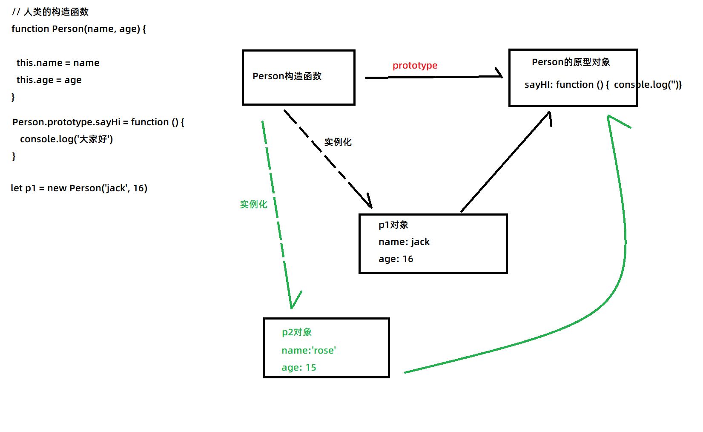
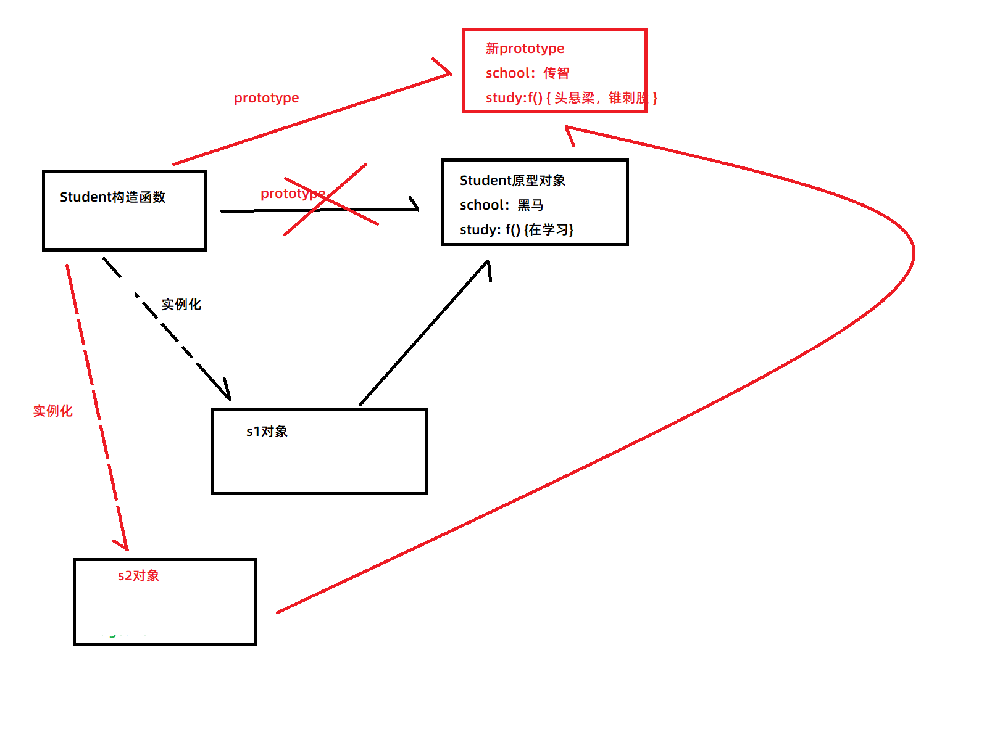
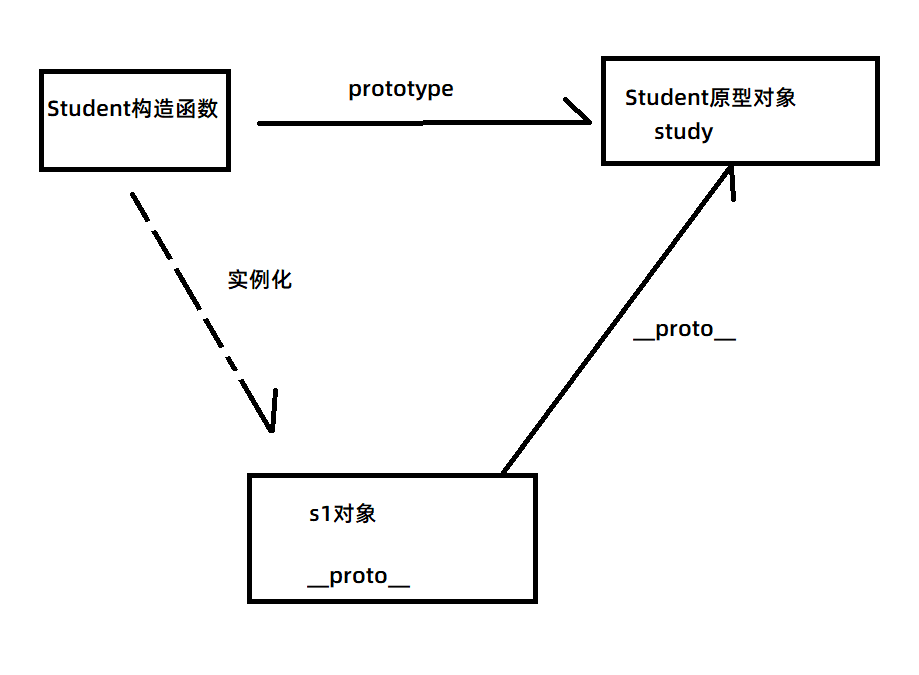
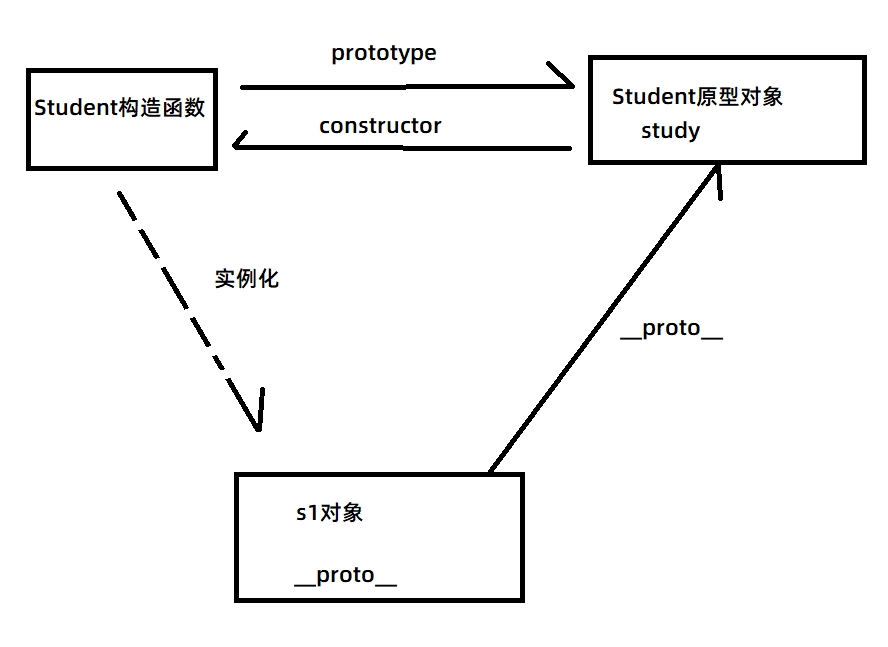
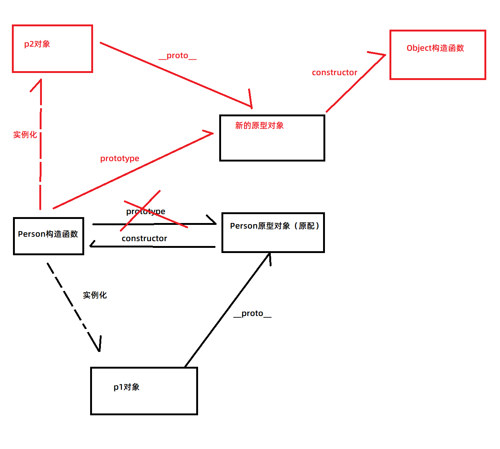
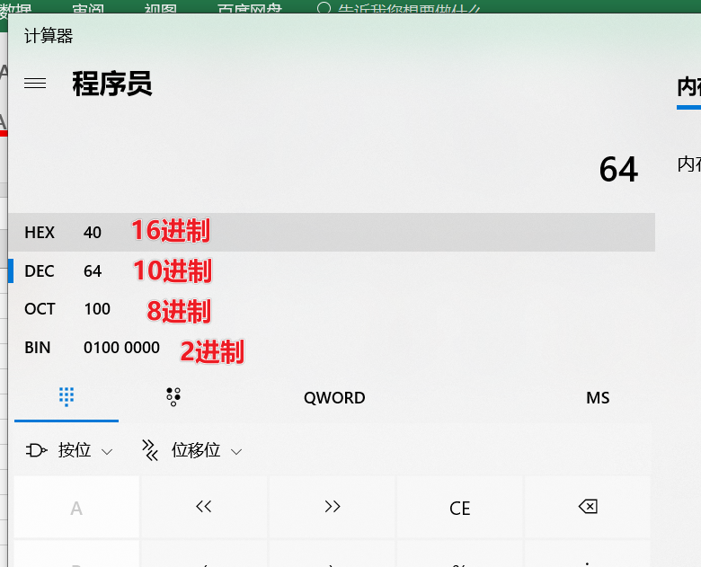

## 复习构造函数

- 构造函数其实就是一种把创建对象代码封装成函数
- 只不过不用自己创建新对象，不用自己返回对象，但是要用new关键字调用这个构造函数


## 使用构造函数可能导致的内存浪费问题

- 如果直接在构造函数里声明方法，那么会导致内存浪费
- 原因：每次来调用构造函数创建对象时，也都会再重新创建一个新的方法（函数），那么就会产生内存空间浪费




## 解决内存浪费办法

- 就把函数先声明在外面，在构造函数方法赋值的时候就赋值为这个函数
- 那样不管创建多少个对象，它的方法指向的都是同一个函数




## 原型对象

- 为什么要有原型对象？

  - 原型对象解决的就是构造函数里内存浪费的问题
  - 不用原型对象，自己写一个跟构造函数对应的对象也可以解决这个问题
  - 但是原型对象相比自己写的对象好处是：1. 不用自己写代码创建  2. 没有变量名污染

- 核心

  - 原型对象不用自己创建，当你写一个构造函数的时候，系统会自动帮你创建一个与之对应的原型对象

  - 如何访问到这个原型对象？

    ```js
     构造函数.prototype
    例：
    function Person (name, age) {
     
        this.name = name
        this.age = age
    }
    
    // Person.prototype 就是原型对象
    
    function Cat () {
        
        
    }
    
    // 就有一个跟Cat对应的原型对象
    // Cat.prototype 就是Cat对应的原型对象
    ```

  - 给原型对象添加的方法，那么通过这个构造函数实例化出来的对象，都会拥有原型对象里定义的方法

  - 

  - 


## 原型对象使用注意事项

- 相同的属性和方法才写到原型对象里，可以节约内存
- 不同的属性值那么就写在构造函数里


## 属性与方法的访问规则

- 对象自己有的，就访问对象自己的，自己没有的才访问原型对象里的
- 并且通过 对象.属性 = 值， 修改的永远都不会是原型对象，而是给自己修改


## 修改原型对象与替换原型对象

- 要修改原型对象，还是得通过 构造函数.prototype 来修改，通过实例化出来的对象只是修改自身
- 
- 如果是在替换原型对象之前实例化的对象，那么这个实例化对象还是指向原来的原型对象
- 如果是在替换原型对象之后实例化的对象，那么这个实例化对象就指向新的原型对象

## \_\_proto\_\_

- \_\_proto\_\_ 是实例化出来的对象默认就拥有的属性，它指向的是自己的原型对象

- 三角关系图：



## constructor

- constructor 其实是原型对象里的属性，它指向的是跟他对应的构造函数



- 如果替换了原型对象，那么原型对象的constructor就指向Object了，而不是指向原来的构造函数

- 如图：

  


## 面向过程与面向对象

- 是两种开发思想
- 面向过程：
  - 专注于解决问题的每一步
- 面向对象：
  - 专注于找一个能解决这个问题的对象
- 现实中例子：
  - 洗衣服
  - 面向过程的思维：
    - 把脏衣服扔进盆里
    - 放洗衣粉
    - 放水泡一下
    - 手搓
    - 揉一揉，拧一拧
    - 倒水
    - 放清水
    - 手洗，拧干
  - 面向对象的思维：
    - 找一个洗衣机来调用洗衣的功能
  - 看起来面向对象的思维在写代码实现功能的时候更方便，但不代表就没有面向过程了
  - 面向对象其实也是由面向过程的代码给封装起来的
  - 所以正确的思路：以后写代码，先优先考虑有没有能解决这个问题的对象，如果有，就直接调用，如果没有这种对象，就自己一步一步实现，然后自己封装成对象，因为自己封装成对象后，下次有相同需求，就可以以面向对象的思维直接调用，甚至也可以分享给别的开发者


## 面向对象封装体验


## 面向对象体验之jQuery


## 面向对象三大特征

- 封装：
  - 把功能的实现，封装到对象内部，但是给外部暴露接口方便调用
- 继承：
  - 某一个类拥有另外一个类的所有属性和方法
  - 类：就是对一个群体的一个抽象表述，提取出这个群体共同的特征和行为来描述，这就是所谓的类
  - 人类：名字、性别、年龄等
    - 中国人一类：
    - 美国人一类：
    - 日本人一类：
  - 动物类：品种、生活习性等
  - ES6以前，JS没有类这个概念，只有C++、Java、C#这些才有类的概念
  - ES6以前的继承：指的是 对象与对象之间的继承，即：**一个对象拥有另外一个对象的所有属性和方法**（并不是广义上的继承概念）
- 多态：
  - 一种行为，不同的实现（形态）
  - 例：动物都要叫的行为，但是实现的方式不一样
    - 猫叫：喵喵喵
    - 猪叫：哼哼哼
    - 狗叫：汪汪汪
  - cut：
    - 对于理发师而言：拿起剪刀剪头发
    - 对于演员而言：停止表演，准备去领盒饭


## 混入式继承

- 就是遍历被继承的对象，取出所有属性和方法，赋值给要继承的对象

  ```js
  for (let key in 父对象) {
      
      子对象[key] = 父对象[key]
  }
  ```

  

## 替换原型对象继承

- 其实把原型对象给直接替换
- 但是首先要准备构造函数
- 把 构造函数.prototype = 父对象
- 缺点：如果之前prototype有属性或方法会被覆盖


## 混合式继承

- 既用了混入，又用了原型，其本质就是把需要继承的属性混入到原型对象里

  ```js
  for (let key in 父对象) {
      
      构造函数.prototype[key] = 父对象[key]
  }
  ```


## 混合式继承的封装


## 进制

