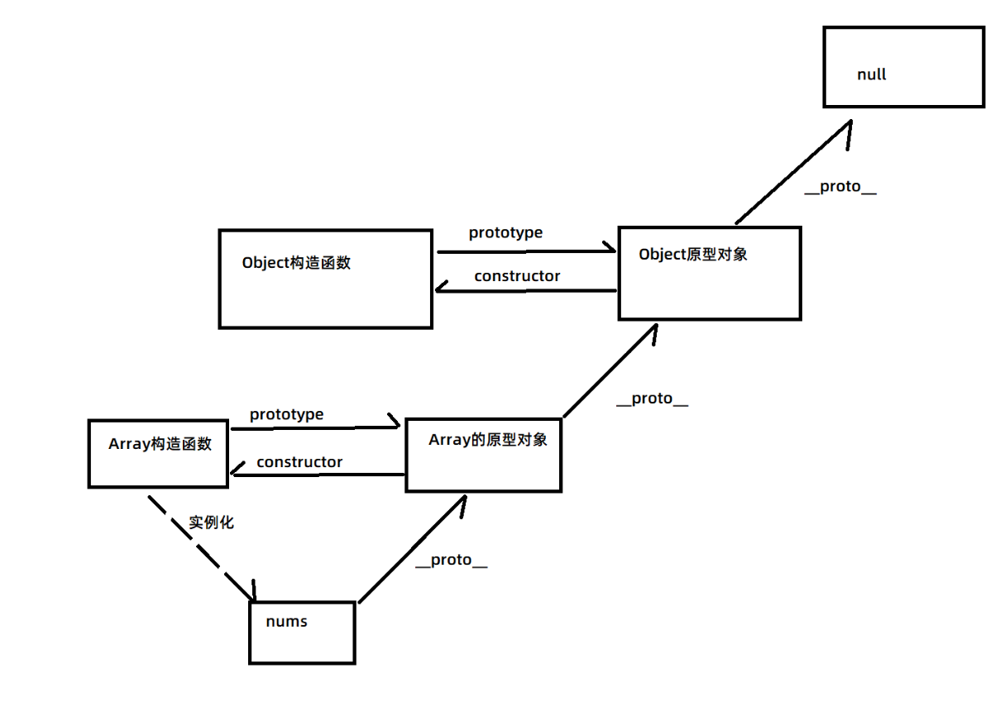
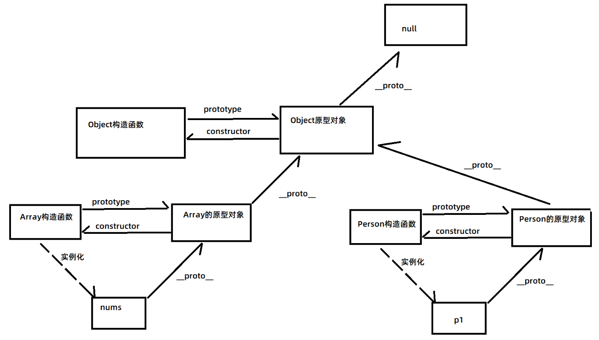
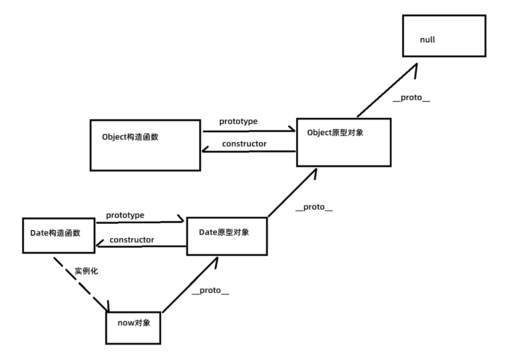
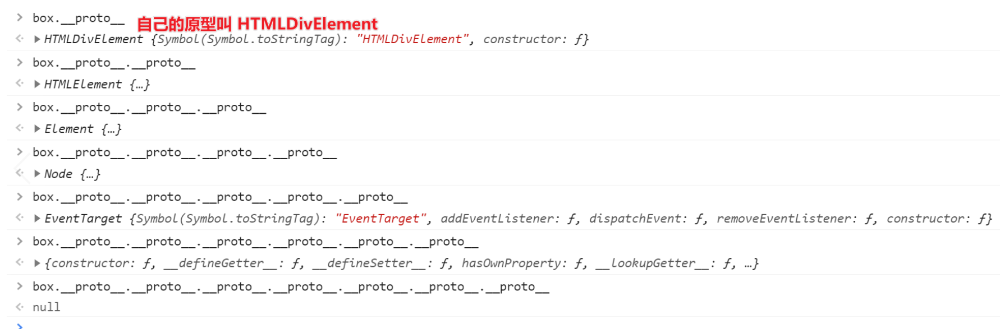
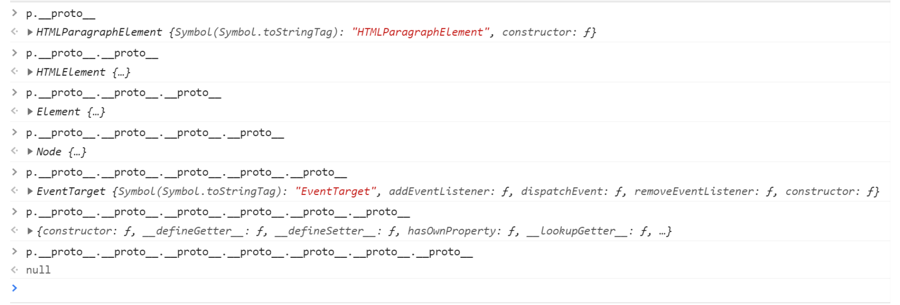

## 复习昨天内容

- 原型对象：可以放一些共有的属性和方法，如果共有的属性和方法放到原型对象里可以节约内存
- 原型对象，本质上也是一种对象，当声明了一个构造函数的时候就自动创建了与之对应的原型对象
- 原型对象可以替换，如果是替换前实例化的对象，那么指向的还是原来的原型对象，如果是替换后实例化的对象，那么指向的是新的原型对象
- 构造函数.prototype 就可以指向原型对象
- 实例对象.\_\_proto\_\_ 也可以指向原型对象
- 原型.constructor 指向它对应的构造函数， 如果是替换的新原型对象，指向的是Object（相当于丢失了真正构造函数的指向），解决办法是给这个原型对象手动写 constructor 又指回原来的构造函数
- 面向过程和面向对象
  - 其实是一种解决问题的思维
  - 面向过程：注重解决问题的每一步
  - 面向对象：注重找一个能解决这个问题的对象
  - 面向对象其实也是面向过程的封装
- 面向对象三大特征
  - 封装： 把代码封装起来，对外只暴露接口（方法）
  - 继承： 指的是一个对象拥有另外一个对象的所有属性和方法 （ES6以后指的是一个类拥有另外一个类的所有属性和方法）
  - 多态： 一种行为，多种形态。 一个方法，有不同的实现
- 混入式继承
  - 遍历被继承的对象，把值赋值给要继承的对象
- 替换原型式继承
  - 需要有构造函数，把构造函数的prototype指向到被继承的对象
  - 那么通过这个构造函数实例化出来的对象，就会拥有被继承对象的所有属性和方法
- 混合式继承
  - 就是遍历被继承的对象，把值赋给原型对象

## 原型链

- 原型对象也有自己的原型对象，像链条一样连接起来就叫原型链
- 原型链最终指向的会是null
- 原型链作用：解释默认继承，例如：凭什么任何对象有toString,是因为会只想到Object原型对象，而Object原型对象里面有toString这个方法，所以对象也有
- 作用2：主要是为了解释完整的访问规则
  - 如果自己有，访问自己的，如果自己没有就访问原型对象的，原型对象还没有，就找原型对象的原型对象，如果找到null都没找到，如果是访问属性就得到undefined，如果是当方法调用就报错

## Array 的原型链

## Date 的原型链

## DOM 的原型链

## 函数也是对象

## 函数的原型链

## 验证函数是由Function实例化

## 构造函数的原型链

## 完整原型链

1. 所有对象都有 `__proto__` 属性，指向了实例化自己的构造函数的原型对象
2. 最终所有对象的 `__proto__` 都会流入 `Object的原型对象`，再最终流入 `null`
3. 构造函数除了能实例化对象外，自身也是对象，也是被实例化出来的
4. 构造函数是被 `Function` 实例化出来的，所以构造函数的 `__proto__` 指向的是 `Function原型对象`
5. `Function` 负责实例化所有构造函数，包括 `Object构造函数` 
6. `Function` 的 `prototype`  和 `__proto__` 指向的都是 `Function原型对象` , `Function原型对象` 又指向 `Object原型对象` 这么设计的目的是为了闭环，并且保证了任意对象查找属性和方法最终都会找到Object，又最终流入null   

## 构造函数和普通函数

## 静态成员和实例成员

- 静态成员：直接给构造函数添加的属性和方法，就叫静态成员
- 实例成员：给实例化对象添加的属性和方法，就叫实例成员
  - 实例对象，不可以访问到静态成员
  - 要访问静态成员，都是通过构造函数来访问

## instanceof 说明

- instanceof 可以判断是不是某种复杂类型
- 原理：是判断某个对象，在不在某个构造函数的原型链上

## in 关键字

- 作用1： 遍历对象
- 作用2： 判断某个属性在不在对象里面，也包括原型

## delete 关键字

- 删除属性，不能删除变量

