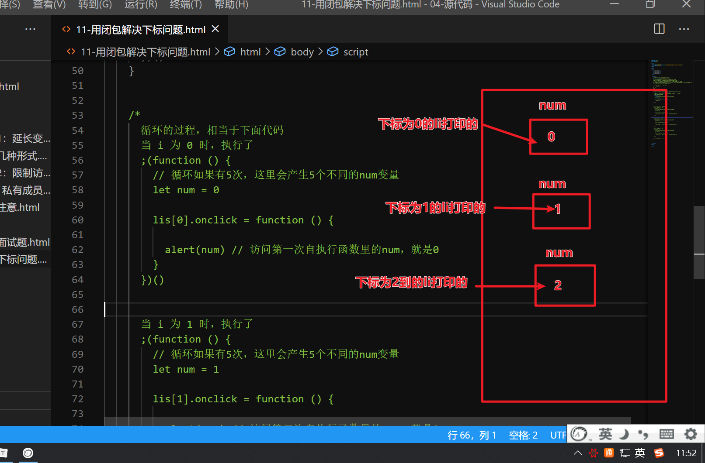
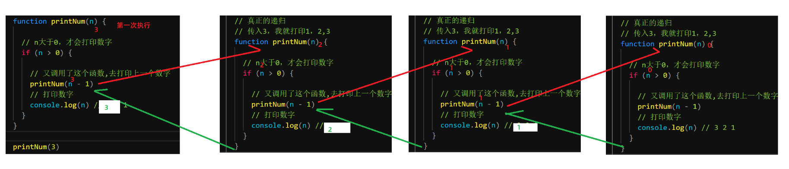
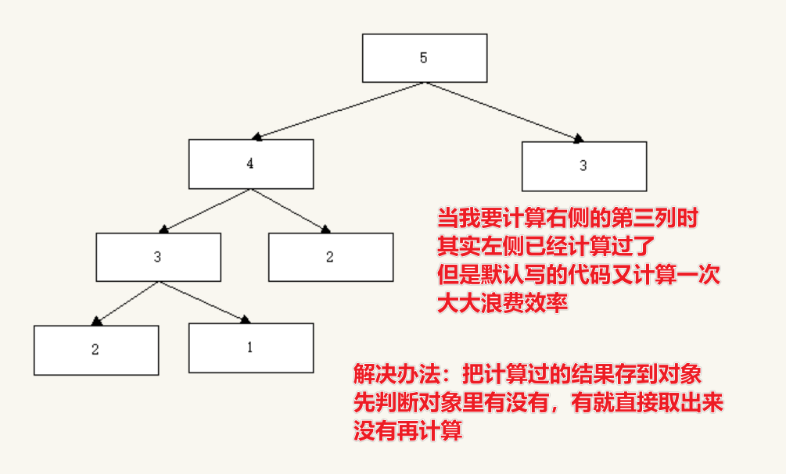

## 闭包介绍

- 闭包是什么？

  - 定义：访问另外一个函数内部变量的函数，就称之为闭包
  - 所以闭包就是一个函数，只不过是一种可以访问另外一个函数内部变量的函数

- 需不需要刻意去说我写个闭包呢？不用，其实闭包在我们不知不觉中就写过了

- 例：

  ```js
  btn.onclick = function () {
        // 函数的内部变量
        let sec = 59
        this.innerText = '还有' + sec + '秒'
        this.disabled = true
  
        let timerId = setInterval(function () {
          // 这个函数里访问了另外一个函数的内部变量
          // 所以这个函数就是闭包
          sec--
          btn.innerText = '还有' + sec + '秒'
          if (sec == 0) {
  
            clearInterval(timerId)
            btn.innerText = '获取验证码'
            btn.disabled = false
          }
        }, 1000)
   }
  ```

  

## 闭包作用1：延长变量生命周期

- 全局变量的生命周期：
  - 从页面打开到页面关闭
- 局部变量的生命周期
  - 从它声明的位置到它所在的作用域结束
- 使用闭包就可以延长局部变量的生命周期
- 但是大量使用闭包可能会导致内存泄漏，所以如果不用了就赋值为null

## 闭包作用2： 限制访问

- 假设以后我们自己写了个插件，里面有各种数据，但是如果直接暴露，外部可以随便乱改
- 利用闭包暴露出去，就可以控制对数据的访问


## 闭包作用3： 私有成员

- 私有成员相当于外界无法直接访问
- 要通过你写的闭包来访问
- 其实有点类似上面的限制访问


## 闭包调用注意事项

- 如果闭包所在的外部函数只调用1次，那么每次调用闭包，访问的都是同一个变量
- 如果闭包所在的外部函数调用多次，那么每次产生的闭包，都是访问的不同的变量


## 闭包两个面试题

```js
        window.name = "The Window"; 
        let object = {
            name: "My Object",  
            getNameFunc: function () { 
                return function () {
                    return this.name;
                };
            }
        };
        console.log(object.getNameFunc()());  

       

        
        //思考题 2：
        window.name = "The Window";
        let object = {
            name: "My Object",  
            getNameFunc: function () { 
                let that = this; 
                return function () {
                    return that.name;
                };
            }
        };
        console.log(object.getNameFunc() ());
```


## 闭包解决用var导致下标错误的问题

- 如果用var为什么有下标问题？
- 因为var是声明在for里，而for又不是函数，所以相当于还是在全局里，所以i是全局变量
- 那么你每个li加的点击事件，都是访问的全局变量i，永远访问的都是同一个
- 而最终i的值变成5了，所以不管你点哪个li，都是得到5
- 解决思路：每个li，要访问不同的变量，并且变量的值还需要依次是0,1,2,3,4
- 所以解决办法：写一个函数，在函数内声明变量，再依次保存01,2,3,4的值，在点击事件里访问这个函数内的变量
- 统一一句话浓缩：使用闭包访问自己作用域里的变量，就都是访问不一样的值了



## let的说明

- let每遇到一个大括号，都是它自己独立的作用域
- 所以for循环几次，就有几个大括号，能保存不同的let值


## 递归介绍

- 递归：就是函数自己调用自己，但一定有结束调用的条件

## 递归图解



## 递归案例：求1-n的和

```js
    // 假如传入的n为5，就要计算1-5的和
    /*
     1 + 2 + 3 + 4 + 5 的和，要算1-5的和，就要先算1-4的和
     1 + 2 + 3 + 4  的和，要算1-4的和，就要先算1-3的和
     1 + 2 + 3      的和，要算1-3的和，就要先算1-2的和
     1 + 2          的和，要算1-2的和，就要先得到1
     1              直接得到1

     假设我有一个函数，就是传入一个数，就能得到1到这个数的结果
     那么我肯定要先传入5，再调用这个函数传入4，再调用这个函数传入3，再调用整函数传入2
     这不就是一个递归调用吗？？
    */
    function getSum(n) {

      if (n == 1) {
        return 1
      }
      // 我getSum就是算1-n的和，那么我这里传入5，就要加上1-4的和
      // 但是又不用一直算下去，因为到1以后又不用算之前的和，直接返回1就行了
      return n + getSum(n - 1)
    }

    console.log(getSum(3))
```


## 递归案例： 求第n列的斐波那契数


## 递归求斐波那契的性能优化



```js
    let obj = {}
    function fibNumber(n) {

      // 先判断一下，我对象里有没有存过这一列的值
      // 如果有，就直接取出数据返回就行了
      if (obj[n]) {

        return obj[n]

      } else {
        // 如果没有，该怎么算就怎么算
        if (n == 1 || n == 2)
          return 1

        // 先把算出不来的结果保存到对象
        obj[n] = fibNumber(n - 1) + fibNumber(n - 2)
        // 再返回这个结果
        return obj[n]
      }
    }
```


## 遍历dom树

```js
    function eachElement (ele) {

      for (let i = 0; i < ele.children.length; i++) {

        // 获取当前元素
        let element = ele.children[i]
        // 打印了当前元素
        console.log(ele.children[i])
        // 当前元素里可能还有子元素，调用这个函数继续遍历
        eachElement(element)
      }
    }
```

