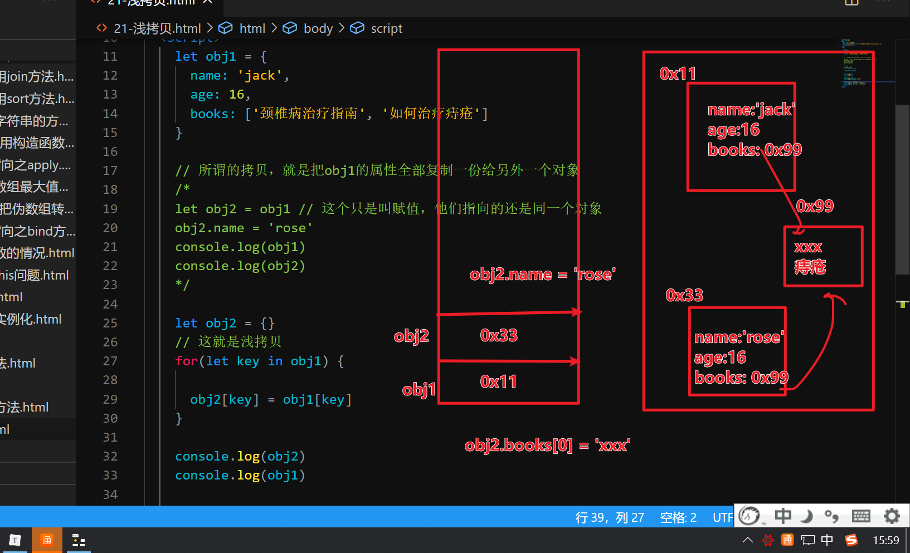

## 复习昨天内容

- 闭包
  - 一个可以访问另一个函数内部变量的函数就叫闭包
  - 闭包作用：延长变量生命周期，限制访问，私有成员，es5以前解决var带来的下标变化
- 递归
  - 一个函数自己调用自己，有结束调用的条件
  - 递归能做的，循环也能做
  - 递归遍历dom树
  - 后端的语言可以操作文件，获取一个文件夹里的所有文件
  - 使用技巧：不要尝试去理解调用之后又调用，就把函数当整体一个功能来理解


## 复习函数内的this

- 函数直接调用，this就是window
- 方法调用，那么调用者是谁，this就是谁
- new调用，那么就是指向new创建的新对象
- 事件内的this，绑定事件的对象是谁，this就是谁

## 修改函数this之call

- call的作用：1.调用函数（方法） 2.修改函数内的this指向

- 语法：

  ```js
  函数.call(要修改的this指向，实参列表)
  ```

- 总结：函数以前怎么用还是怎么用，只是多一个第一个参数，这个参数用来修改this的指向

- 细节：

  - 如果call什么参数都没传，或者是null或者是undefined，那么this内的指向一定是window
  - this的指向只能是复杂类型，如果传基本类型也会包装成复杂类型


## call案例：借用真数组方法之push

```js
    let weiArr = {
      0: 10,
      1: 20,
      2: 30,
      length:3
    }

    // call可以借用别的对象的方法
    // 因为这句话相当于把push里的this改成了weiArr，并且传入了参数为40
    Array.prototype.push.call(weiArr, 40)
    console.log(weiArr)
    Array.prototype.push.c
```


## call案例：借用真数组方法之join

```js
    let weiArr = {
      0: '张三丰',
      1: '杨过',
      2: '小龙女',
      length:3
    }
    
    let str = Array.prototype.join.call(weiArr, '|')
    console.log(str)
```


## call案例： 借用真数组方法之sort

```js
    let wei = {
      0: 32,
      1: 54,
      2: 765,
      3: 1432,
      4: 26,
      5: 3,
      length: 6
    }

    Array.prototype.sort.call(wei, function (a, b) {

      return a - b 
    })
    console.log(wei)
```


## call案例： 借用构造函数

```js
    function Person(name, age) {

      this.name = name
      this.age = age
    }

    Person.prototype.sayHi = function () {

      console.log('你好，我叫' + this.name)
    }

    // 人类下面又有学生类
    function Student(name, age, stuNo) {

      // 借用构造函数来继承
      // 把刚刚创建的学生对象传入到Person，修改了Person里的this
      // 所以赋值就相当于是给当前这个创建的学生对象进行赋值
      Person.call(this, name, age)
      this.stuNo = stuNo
    }

    // 如果要完整的继承，除了借用构造函数，还要把Person原型里的成员
    // 混入到Student里的原型里面
    for (let key in Person.prototype) {

      Student.prototype[key] = Person.prototype[key]
    }

    let s1 = new Student('jack', 16, 1)
    console.log(s1)
    s1.sayHi()
```


## 修改函数this之apply

- 它也可以调用函数，并且也可以修改this指向

- 跟call区别：它传递给函数的参数要写成数组或者伪数组

- 语法

  ```js
  函数.apply(修改this指向的对象, 数组/伪数组 )
  ```

  

## apply案例：伪数组转真数组


## 修改函数之bind

- bind方法，用来修改某个函数内的this指向，不会调用函数，但是会产生一个新的函数（这个新的函数里的this相当于被替换成你修改的指向）
- 这个新函数以后不管在任何地方都是修改后的this


## bind带实参的说明

- bind时如果仅仅只是改this指向，那么后面调用新函数，还需要自己传递实参，传的是什么就是什么

- bind时如果既传入了this指向，又传入了实参，那么后面调用新函数，不管你传什么，它的实参永远都是bind时的实参

  ```js
      let obj1 = { name: 'obj1' }
      let newSum = getSum.bind(obj1)
      newSum() // undefined undefined obj1
      // newSum已经是修改了this指向的函数，所以直接传递实参就可以了
      newSum(100, 200) // 100 200 obj1
  
      // 在绑定的时候也可以直接传递实参
      // 以后实参无法改，它相当于写死了
      let newSum2 = getSum.bind(obj1, 50, 40)
      newSum2() // 50 40 obj1
      newSum2(999,888) // 50 40 ob1
  ```

  

## bind 案例： 修改定时器指向

```js
let timerId = setInterval((function () {

        sec--
        this.innerHTML = '还有' + sec + '秒'
        if (sec == 0) {
          clearInterval(timerId)
          this.innerHTML = '获取验证码'
          this.disabled = false
        }

}).bind(this), 1000)
```


## 类与对象

- 类：对一个群体（类别）的抽象描述，描述这种群体有哪些特征和行为，但是不具体，相当于是图纸
- 对象：就是某个群体中具体的实际例子，也叫实例，它更具体。相当于根据图纸造出来的事物
- ES6以前是通过构造函数表示类的

## 类的声明

- ES6以后就专门有个关键字用来修饰类

- class 专门用来声明一个类

- 语法：

  ```js
  class 类名 {
      // 构造函数
      constructor (形参列表) {
          this.属性 = 值
      }
      
      // 方法列表
  }
  ```

- 例：

  ```js
      // 人类
      class Person {
        // 构造函数，当你new这个类的时候
        // 它就会自动调用constructor
        constructor(name, age){
          // console.log('被调用了',name,age)
          this.name = name
          this.age = age
        }
  
        // 注意：在类的大括号里面，不要加逗号
        // 方法写在外面，而且不要写function
        // es6里面这样写就叫方法
        sayHi () {
  
          console.log(`大家好，我叫${this.name}，今年${this.age}岁`)
        }
  
        eat (food) {
  
          console.log(`我是${this.name}，今天吃${food}`)
        }
      }
  ```

- 注意：

  - 在类的大括号里不要写逗号分隔，直接不要写任意符号
  - 如果要写方法，不用写function

  

## 类的本质

- 类的本质其实还是构造函数
- 类里的声明其实也是在构造函数.prototype里面
- 本质跟以前写的那套没区别


## 类的继承

- 一个类拥有另一个类的所有属性和方法
- 例：
  - 人类：有姓名、年龄、性别等
    - 中国人类：继承自人类
    - 美国人类：继承自人类
  - 动物类：有毛色、体重、栖息地
    - 猫类：继承自动物类
    - 狗类：继承自动物类
  - 父类是一个更大的类别，子类是这个大类下的又某一个分类

- ES6实现类的继承的语法：

  ```js
  class 类名 extends 父类名 {
      
      constructor (参数列表) {
          
          super()
          this.xxx = xxx
      }
  }
  ```

  - 既声明了一个类，又指定这个类继承了哪个类
  - 注意：如果在子类写了constructor，那么在contructor里必须先写super()调用父类的构造函数

- 细节：

  - 如果子类没写构造函数，那么直接会调用父类的构造函数
  - 如果子类写了构造函数，那么无论如何都需要手动调用父类的构造函数，也就是必须先要写 `super()`
  - 如果没写继承，默认继承自Object


## 方法的重写

- 每个类里定义的方法，相当于是这个类（构造函数）里原型对象定义的方法
- 所以根据这个类创建出来的方法都会有这些方法
- **父类定义的方法，子类也可以定义同名的方法，这个就叫方法的重写**
- 自己有访问自己的，自己没有访问父类

## 多态

- 目前能体会到多态可以让代码灵活些

  ```js
  let type = +prompt('请输入您想听的动物叫声')
      let animal = null
      switch (type) {
  
        case 1:
          animal = new Cat()
          break
        case 2:
          animal = new Dog()
          break
        case 3:
          animal = new Pig()
          // 猪叫
          break
      }
  
      animal.shout()
  ```

  

## super关键字

- super调用父类构造函数
  - 当子类继承了一个类，而且写了constructor，必须先写 super(传递参数)
- 当需要调用父类方法时，可以用super关键字
  - super.方法名(参数列表)


## 浅拷贝和深拷贝

- 这里讲的是如何拷贝一个对象，跟之前学的浅克隆和深克隆不是同一个东西（之前的指的是html元素的克隆）

- 浅拷贝：

  - 把一个对象里的所有属性拷贝一份给另外一个对象

  - 但是如果对象的某个属性是数组或对象，那么仅拷贝这个数组或对象的地址

    ```JS
        let obj1 = {
          name: 'jack',
          age: 16,
          books: ['颈椎病治疗指南', '如何治疗痔疮'],
          pet: {
            nickname:'sb',
            age:16
          }
        }
    
        let obj2 = {}
        // 这就是浅拷贝
        for(let key in obj1) {
    
          obj2[key] = obj1[key]
        } 
    ```

    

- 


- 深拷贝
  - 拷贝一个对象里的所有属性，但是如果遇到属性是数组或对象，那么会继续对这个数组和对象拷贝副本
  - 要利用递归