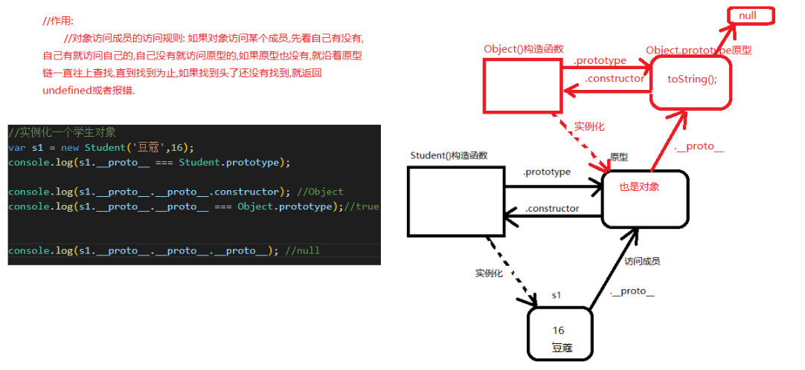
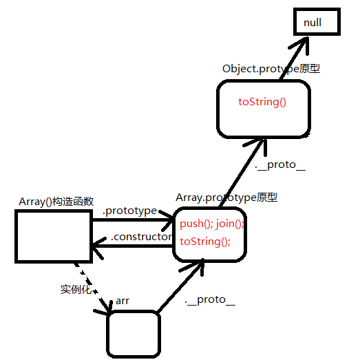
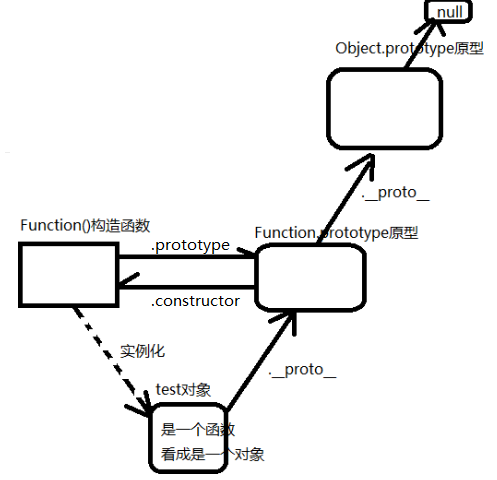

# 第一天

## 1.面向对象思想

```js
//1.啥是面向对象?
//面向过程和面向对象都是解决问题的一种思路.一种思想. 

//eg:要洗衣服
//面向过程: 注重的是过程,什么都是自己亲力亲为. 
//收集脏衣服
//放水放洗衣液泡一泡
//揉一揉,踩一踩,搓一搓
//清水
//拧干晒干

//面向对象: 注重的是结果.
//找一个专业洗衣服的对象来调用他洗衣服的方法来帮你完成洗衣物
//洗衣机

//eg:数组排序
//面向过程: 冒泡排序,两两比较大就交换....
//面向对象: sort();


//面向对象好, 不是有了面向对象就不需要面向过程了,面向对象是面向过程的一个封装. 


//----------------------------------------
//复习一下如何理解对象: 
//1. 和变量/数组一样的,都是用来存放数据的. 
//2. 抽象化/具体化的层面去理解. 对象是一个具体的存在. 
//   学生 黑马程序员的学生  黑马程序员深圳校区前端的学生  黑马程序员深圳校区前端46期的杨俊杰这个学生
// var obj = {
//     name:'龙翔',
//     age:18
// }
```

### 1.1 面向对象举例01

```html
<!DOCTYPE html>
<html lang="en">

<head>
  <meta charset="UTF-8">
  <meta name="viewport" content="width=device-width, initial-scale=1.0">
  <meta http-equiv="X-UA-Compatible" content="ie=edge">
  <title>Document</title>
  <style>
    div,
    p {
      width: 100px;
      height: 100px;
      margin-top: 20px;
    }
  </style>
</head>

<body>
  <div></div>
  <div></div>
  <div></div>
  <p></p>
  <p></p>
  <p></p>

  <script>
    //需求:给这三个div和三个p设置边框.
    //1.以前的做法
    // let divs = document.getElementsByTagName('div');
    // let ps = document.getElementsByTagName('p');
    // //遍历出每一个div和p
    // for (let i = 0; i < divs.length; i++) {
    //   divs[i].style.border = '1px solid red';
    // }
    // for (let i = 0; i < ps.length; i++) {
    //   ps[i].style.border = '1px solid green';
    // }

    //2.上面的代码可以封装成函数
    // function getEles(tagName) {
    //   return document.getElementsByTagName(tagName);
    // }

    // function setStyle(eles, value) {
    //   for (let i = 0; i < eles.length; i++) {
    //     eles[i].style.border = value;
    //   }
    // }
    // //调用我们自己封装的函数来完成需求
    // let ps = getEles('p');
    // let divs = getEles('div');
    // setStyle(ps, '1px solid red');
    // setStyle(divs, '1px solid green');


    //3.把上面这个代码封装到一个对象中  面向对象思想. 
    let obj = {
      getEles: function (tagName) {
        return document.getElementsByTagName(tagName);
      },
      setStyle: function (eles, value) {
        for (var i = 0; i < eles.length; i++) {
          eles[i].style.border = value;
        }
      }
    }
    //调用我们自己封装的对象,里面专业的方法来完成我们的需求. 
    let ps = obj.getEles('p');
    let divs = obj.getEles('div');
    obj.setStyle(ps,'1px solid blue');
    obj.setStyle(divs,'1px solid skyblue');

  </script>
</body>

</html>
```

### 1.2 面向对象举例02

```html
<!DOCTYPE html>
<html lang="en">

<head>
  <meta charset="UTF-8">
  <meta name="viewport" content="width=device-width, initial-scale=1.0">
  <meta http-equiv="X-UA-Compatible" content="ie=edge">
  <title>Document</title>
  <style>
    div,
    p {
      width: 100px;
      height: 100px;
      margin-top: 20px;
    }
  </style>
</head>

<body>
  <div></div>
  <div></div>
  <div></div>
  <p></p>
  <p></p>
  <p></p>

  <script src="./jquery-1.12.4.js"></script>
  <script>
    //面向对象思想. 
    $('div').css('border','1px solid red');
    $('p').css('border','1px solid green');


    //以后我们面对一个需求:
    //先看有没有人帮我们写好了这样的对象,可以直接拿来用就能解决这个问题. 
    //如果没有就自己写一个这样的对象. 好处是代码的复用. 
  </script>
</body>
</html>
```


## 2.原型

### 2.1 引出原型01

```js
//1. 方法体写在构造函数中
//缺点: 浪费内存空间. 
function Student(name,age){
    this.name = name;
    this.age = age;
    this.sayHi = function(){
        console.log('我的名字是'+this.name);
    }
}
//实例化学生对象
let s1 = new Student('陈俊伟',20);
s1.sayHi();
let s2 = new Student('豆蔻',16);
s2.sayHi();
//思考一个问题:
console.log(s1.sayHi === s2.sayHi);//false
```


### 2.2 引出原型02

```js
//2. 把方法体提炼到构造函数的外面.
//解决内存浪费的问题
//会产生新的问题: 全局变量污染
function test() {
    console.log('我的名字是' + this.name);
}
function Student(name, age) {
    this.name = name;
    this.age = age;
    this.sayHi = test;
}
//实例化学生对象
let s1 = new Student('陈俊伟', 20);
s1.sayHi();
let s2 = new Student('豆蔻', 16);
s2.sayHi();
//思考一个问题:
console.log(s1.sayHi === s2.sayHi); //true

//如果又有一个Teacher构造函数的方法体需要提炼到构造函数的外面.
//那这里的test函数就会和上面的test函数冲突
function test(){
    console.log('我是老师');
}
function Teacher(nam,age){
    this.name = name;
    this.age = age;
    this.sayHi = test;
}
```


### 2.3 引出原型03

```js
//3.把提炼出来的方法体写在一个对象中. 
//这样就能避免全局变量污染. 
//又有一个不好的地方: 每次声明一个构造函数,都要配套的给他声明一个对象来存放他提炼出来的方法体.
let obj = {
    test: function () {
        console.log('我的名字是' + this.name);
    }
}
function Student(name, age) {
    this.name = name;
    this.age = age;
    this.sayHi = obj.test;
}
//实例化学生对象
let s1 = new Student('陈俊伟', 20);
s1.sayHi();
let s2 = new Student('豆蔻', 16);
s2.sayHi();
//思考一个问题:
console.log(s1.sayHi === s2.sayHi); //true
```


### 2.4 什么是原型

```js
function Student(name, age) {
    this.name = name;
    this.age = age;
}
//有没有一个东西,能解决我们现在这里遇到的: 空间浪费,全局变量污染,不需要手动配套写一个对象. 
//如果有那就太爽了. 
//有,这就是原型.


//1.什么是原型
//构造函数被创建,系统都会自动的为他生成一个对应的对象,这个对象就是原型. 


//2.如何访问这个原型
//语法: 构造函数名.prototype
console.log(Student.prototype); //是一个对象


//3.既然原型是一个对象,那可不可以往这个对象中添加成员(属性/方法);
//可以的
Student.prototype.sb = '随便';
Student.prototype.dsb = function(){
    console.log('你是一个大随便...');
}
//console.log(Student.prototype);


//4.谁能访问原型中添加的成员. 
//a:原型对象自己可以. 
console.log(Student.prototype.sb);
Student.prototype.dsb();

//b.这个原型对应的构造函数实例化出来的对象们可以访问. 
//实例化学生对象们
let s1 = new Student('俊伟', 20);
s1.dsb();
let s2 = new Student('豆蔻', 16);
s2.dsb();
console.log(s1.dsb === s2.dsb); //true                                                       
```


 ### 2.5使用原型需要注意的地方

```js
//使用原型需要注意的地方. 
//1.什么样的数据可以往原型中添加? 
//原型对应的构造函数实例化出来的对象们公共的数据. 
function Student(name, age,gender) {
    this.name = name;
    this.age = age;
    this.gender = gender;
}
//每一个学生都有一个打招呼的方法,而且打招呼都一样,所以是一个公共的方法,就可以写在原型中. 
Student.prototype.sayHi = function(){
    console.log('我是学生,我的名字是'+this.name);
}
//每一个学生都有一个type
Student.prototype.type = '人';
//实例化学生对象们
let s1 = new Student('俊伟',20,'男');
console.log(s1.type);
let s2 = new Student('乔碧萝',40,'女');
console.log(s2.type);


//2.对象访问成员(属性/方法)的访问规则.
//对象自己有这个成员,那就访问对象自己的; 对象自己没有这个成员,那就访问原型的.... 
function Dog(name,pingZhong){
    this.name = name;
    this.pingZhong = pingZhong;
    this.sayHi = function(){
        console.log('啦啦啦啦啦,哈哈哈哈哈,呵呵呵呵,嘻嘻嘻');
    }
}
//每一只小狗都有一个叫的方法,叫法一样那叫的方法就应该写在原型中
Dog.prototype.sayHi = function(){
    console.log('我是一只小狗,汪汪汪...');
}
//实例化小狗对象
let d1 = new Dog('绿群','泰迪');
d1.sayHi();


//3.访问原型(给原型中加东西,修改原型中的东西),一定要遵守 构造函数.prototype这种格式. 
function Cat(name,pingZhong){
    this.name = name;
    this.pingZhong = pingZhong;
}
//每一只小猫都有叫的方法,都是一样的所以写在原型中
Cat.prototype.sayHi = function(){
    console.log('我是一只小猫,喵喵喵...');
}
//修改原型中的sayHi方法
Cat.prototype.sayHi = function(){
    console.log('这才是修改原型中的sayHi方法');
}

//实例化猫对象 
let c1 = new Cat('黑裙','非洲猫');
//下面这句话的意思是给c1自己添加一个sayHi方法.
// c1.sayHi = function(){
//     console.log('我是修改后的sayHi');
// }
//那自己有了sayHi方法,那就不会去找原型中的sayHi
c1.sayHi();

//再来实例化一个猫对象
let c2 = new Cat('林哥','加菲猫');
c2.sayHi();


//4.原型可以替换
//那实例化出来的对象,是访问替换之前原型中的方法,还是访问替换之后原型中的方法?
//取决于这个对象是在原型替换之前实例化的,还是原型替换之后实例化的. 
//如果是替换之前实例化的,访问原来原型中的方法. 
//如果是替换之后实例化的,访问替换之后原型中的方法. 
function Student(name, age) {
    this.name = name;
    this.age = age;
}
//每一个学生都有一个努力学习的方法. 
Student.prototype.study = function () {
    console.log('我是学生,我在努力的学习...');
}

//原型可以替换
Student.prototype = {
    study: function () {
        console.log('我在学nm呀,我在睡觉呀...');
    }
}

//实例化一个学生对象
let s1 = new Student('豆蔻', 17);
s1.study();
```


## 3. `__proto__` 属性

```js
//1.__proto__属性
//属于实例化对象的. 
//指向创建这个对象的构造函数对应的原型
function Student(name, age) {
    this.name = name;
    this.age = age;
}
//实例化学生对象们
let s1 = new Student('俊伟', 20);
console.log(s1);
console.log(s1.__proto__ === Student.prototype);//true

//2.注意
//__proto__不是标准的w3c的属性,所以实际开发的时候不要使用. 
//平时学习,测试一些数据,验证一些关系的时候可以使用.
//真的可以往原型中添加方法. 只不过这种操作原型的方式,实际开发的时候不要使用.  
s1.__proto__.sayHi = function(){
    console.log('哈哈哈哈哈,我是学士');
}
let s2 = new Student('柯南',13);
s2.sayHi();
```


## 4.constructor属性

```js
//1.constructor属性
//是原型对象的. 
//指向这个原型对象对应的构造函数. 
function Student(name, age) {
    this.name = name;
    this.age = age;
}
Student.prototype.study = function () {
    console.log('我是学生,我在学习');
}
//打印一下原型
console.log(Student.prototype);
//验证
console.log(Student.prototype.constructor === Student);//true


//2.下面这句话有没有错 ?
//没有,s1这个对象没有constructor属性,所以去访问原型中的constructor属性,那就指向了构造函数. 
let s1 = new Student('俊杰',20);
console.log(s1.constructor); //会用这种方式去判断s1对象是那个构造函数实例化的. 


//3. 下面这句话有没有错? 
//不会有错. 
let s1 = new Student.prototype.constructor('豆豆',18);
console.log(s1);


//4.原型替换后constructor的指向会丢失. 
//丢失了可以找回来. 
Student.prototype = {
    constructor:Student
};
console.log(Student.prototype.constructor === Student); //true
```


# 第二天

## 1.面向对象三大特征(了解)

```js
//面向对象语言(c#,java...)有三大特征: 封装/继承/多态

//js是基于对象的语言: 
//封装:将功能封装整合在对象中,对外只暴露指定的接口,外界在使用的时候,只需要考虑接口怎么用就用,不需要关心内部如何实现. 
//继承:js中继承是对象之间的继承,如果一个对象想要有另外一个对象的成员,那么就让这个对象继承另外一个对象.
//js没有多态:
```

## 2.继承的方式

### 2.1 混入式继承

```js
//1.混入式
let wangjianlin = {
    house:{
        address:'东京',
        price:10000000
    },
    car:{
        brand:'劳斯奈斯.幻影',
        price:5000000
    }
}

let wangsicong = {
    girlFriends:['豆得儿','雪梨','林更新','林绿群','001']
}
//wangsicong这个对象,想拥有wangjianlin这个对象的house和car.
//那就可以让wangsicong这个对象,继承wangjanlin这个对象. 
for(let key in wangjianlin){
    wangsicong[key] = wangjianlin[key]; //其实这句话在给wangsicong这个对象添加成员. 
}
console.log(wangsicong);
```

### 2.2 替换原型式继承

```js
//2.替换原型式
let wangjianlin = {
    house:{
        address:'东京',
        price:10000000
    },
    car:{
        brand:'劳斯奈斯.幻影',
        price:5000000
    }
}

//准备一个ZhaNan构造函数
function ZhaNan(gfs) {  
    this.gfs = gfs;
}
//每一个渣男都有一个哄女孩子吃6块钱麻辣烫的方法. 
ZhaNan.prototype.huaQian = function(){
    console.log('我是渣男,我会请女孩子吃6块钱麻辣烫...');
}
//我希望每一个通过这个ZhaNan构造函数实例化出来的渣男对象,都拥有wangjianlin这个对象的车和房. 
//那就应该继承
ZhaNan.prototype = wangjianlin;

//实例化一个渣男对象
let lvqun = new ZhaNan(['伍菇凉','苍老师','波多老师','小泽老师','俊伟','龙翔']);
console.log(lvqun);
```

### 2.3 混合式继承

```js
//3.混合式
let wangjianlin = {
    house:{
        address:'东京',
        price:10000000
    },
    car:{
        brand:'劳斯奈斯.幻影',
        price:5000000
    }
}

//准备一个ZhaNan构造函数
function ZhaNan(gfs) {  
    this.gfs = gfs;
}
//每一个渣男都有一个哄女孩子吃6块钱麻辣烫的方法. 
ZhaNan.prototype.huaQian = function(){
    console.log('我是渣男,我会请女孩子吃6块钱麻辣烫...');
}

//我们希望每一个ZhaNan实例化对象,都能拥有王健林这个对象的成员,那就要继承
for(let key in wangjianlin){
    ZhaNan.prototype[key] = wangjianlin[key];
}

//实例化一个渣男对象
let lvqun = new ZhaNan(['伍菇凉','苍老师','波多老师','小泽老师','俊伟','龙翔']);
console.log(lvqun);
```


## 3.原型链

```js
//原型链:
//每一个对象都有一个原型,原型也是对象,那原型也有原型,这样就形成了一个链式结构,成为原型链. 
function Student (name,age){
    this.name = name;
    this.age = age;
}
//每一个学生都有一个学习的方法
Student.prototype.study = function(){
    console.log('我在学生,我爱学习...');
}
//实例化一个学生对象
let s1 = new Student('豆蔻',16);
console.log(s1);
console.log(s1.__proto__ === Student.prototype);//true
console.log(s1.__proto__.__proto__.constructor); //Object
console.log(s1.__proto__.__proto__ === Object.prototype);//true
console.log(s1.__proto__.__proto__.__proto__); //null
console.log(s1.name);
s1.study();
console.log(s1.gender); //undefined 自己没有,原型中也没有,返回undefined.
s1.swiming(); //报错了.  自己没有,原型中也没有,就报错
s1.toString();//自己没有,原型也没有,但是原型的原型中有,所以也不会报错.

//原型链作用: 
//对象访问成员的访问规则: 如果对象访问某个成员,先看自己有没有,自己有就访问自己的,自己没有就访问原型的,
//如果原型也没有,就沿着原型链一直往上查找,直到找到为止,如果找到头了还没有找到,就返回undefined或者报错.
```

**原型链图解如下**:




## 4.内置对象的原型链

### 4.1 数组对象的原型链

```js
//数组对象
let arr = new Array(10,20,30);
console.log(arr.__proto__ === Array.prototype);//true
console.log(arr.__proto__.__proto__.constructor);//Object
console.log(arr.__proto__.__proto__ === Object.prototype);//true
```




### 4.2 日期对象的原型链

```js
//日期对象
let date1 = new Date();
console.log(date1.__proto__ === Date.prototype); //true
console.log(date1.__proto__.__proto__.constructor);//Object
console.log(date1.__proto__.__proto__ === Object.prototype);//true
console.dir(date1); //查看日期对象使用console.dir();
```


### 4.3 dom对象的原型链

```js
//dom元素的原型链. 
let div1 = document.querySelector('div');
console.log(div1.__proto__ === HTMLDivElement.prototype);//true

let p1 = document.querySelector('p');
console.log(p1.__proto__ === HTMLParagraphElement.prototype);//true
```

  


## 5.函数也是一个对象

```js
//1.函数也是对象. 
function test(){
    console.log('哈哈');
}
//查看函数对象使用console.dir();
console.dir(test);
//下面这两句话是把函数当做对象,往里面添加sb属性和dsb方法
test.sb = '随便';
test.dsb = function(){
    console.log('哈哈,你是一个大随便...');
}
//调用属性和方法 可以调用
console.log(test.sb);
test.dsb();


//2.函数既然是一个对象,那这个对象是由哪一个构造函数实例化的呢? Function()构造函数
console.log(test.__proto__.constructor);
console.log(test.constructor);
console.log(test.__proto__ === Function.prototype); //true

console.log(test.__proto__.__proto__.constructor); //Object()
console.log(test.__proto__.__proto__ === Object.prototype);//true
```


**函数作为对象的原型链图解**




## 6.函数是由Function()构造函数创建出来的对象(了解)

```js
//函数是对象,是由Function()构造函数实例化出来的. 

//1.创建了一个没有函数体的函数  
let test1 = new Function();
console.log(test1);
console.log(typeof test1); //function


//2.创建了有函数体的函数  
let test2 = new Function("console.log('我是一个函数,哈哈哈')");
console.log(test2);
test2();


//3.创建一个有参数以及有函数体的函数  
let test3 = new Function("num1","num2","console.log('我是一个函数,哈哈哈');console.log(num1+num2)");
console.log(test3);
test3(10,20);


//4.创建一个有参数以及有函数体以及有返回值的函数  
let test4 = new Function("num1","num2","console.log('我是一个函数,哈哈哈');return num1+num2;");
console.log(test4);
console.log(test4(100,200));


//注意:-------------------------------------------------
//平时使用函数还是用之前学的方式创建函数.
//1.函数声明语句的方式声明函数
function test1(){
   console.log('我是test1函数');
} 


//2.函数表达式的方式声明函数
var test2 = function(){
	console.log('我是test2函数');
}
```


## 7.构造函数也是对象

```js
//构造函数也是对象,也是由Function()构造函数实例化出来的. 
function Student(name,age){
    this.name = name;
    this.age = age;
}
console.dir(Student);
console.log(Student.__proto__ === Function.prototype);//true
console.log(Student.__proto__.__proto__ === Object.prototype); //true

//实例化学生对象
let s1 = new Student('俊杰',19);
console.log(s1.__proto__.__proto__ === Object.prototype);//true
```


**构造函数作为对象的原型链**


## 8.完整的原型链

**要能分清楚构造函数的2重身份:**

**a:构造函数作为构造函数实例化对象.** 

**b:构造函数作为对象,被Function()构造函数创建.** 


# 

# 第三天

## 1.什么是闭包

```js
//什么是闭包?
//是声明在函数内部,可以访问函数内部的局部变量的这么一个函数.

//01.第一种表现形式 
function test(){
    var num = 10;
    function test2(){
        console.log(num);
    }
    return test2;
}
var fn = test(); //调用test函数,有一个返回值,返回值是函数.  
fn();//那调用fn其实就是在调用这个test2


//02.第二种表现形式
var fn2 = (function(){
    var num1 = 100;
    function inner(){
        console.log(num1);
    }
    return inner;
}());
fn2(); //这里调用fn2本质上也是在调用inner
```


## 2.闭包的作用

### 2.1提升变量的生命周期.

```js
//1.闭包的作用01-提升变量的生命周期. 
//就是说可以在函数外部访问函数内部的局部变量. 

//2.变量生命周期: 从变量的声明到变量的回收. 
//2.1 局部变量:从声明他开始到 声明他的那个函数执行完毕结束. 
function test(){
    var num1;
    console.log('哈哈');
    num1 = 10;
    console.log('呵呵');
    console.log(num1);
}
test();
console.log(num1); //报错了 num1 is not defined, 因为变量已经被回收了
//2.2 全局变量:
//从声明出来开始,到程序结束(页面关闭). 


//3.提升变量的生命周期. 
//本来要回收的,结果没有回收.
function test(){
    var num1 = 10;
    function test2(){
        console.log(num1);
    }
    return test2;
}
var fn = test(); //调用test函数,会有一个函数作为返回值.就是test2函数. 
fn();//调用fn,相当于调用test2函数.
```


### 2.2 提供有限的访问权限

```js
//1.闭包的作用02-提供有限的访问权限. 
function test() {
    var num = 10;
    function getNum() {
        return num;
    }
    function setNum(value) {
        //这里是一个函数,既然是函数就可以在这里写任意的代码. 
        //就可以写对这个num做赋值逻辑过滤的代码
        if (value >= 0 && value <= 140) {
            num = value;
        }
    }
    return {
        getNum: getNum,
        setNum: setNum
    }
}

var obj = test(); //调用test函数,会返回一个对象,这个对象里面有2个方法: 一个是getNum,一个是setNum
obj.setNum(1000);
console.log(obj.getNum());
```


### 2.3 声明私有属性

```js
//闭包的作用03-可以声明私有属性

//01:以前写构造函数
function Student(name,age){
    this.name = name;
    this.age = age;
}
//实例化学生对象: name和age等这些属性 可以直接对象访问.
var s1 = new Student('龙翔',20);
console.log(s1.name);
console.log(s1.age);


//02: 声明私有属性的构造函数
function Student(name){
    var age = 10; //局部变量age,外面不能直接访问
    this.name = name;
    //对age做操作的方法
    this.setAge = function(value){
        //判断
        if(value >= 0 && value <= 140){
            age = value;
        }
    }
    this.getAge = function(){
        return "我的年龄不方便透露哦..."
    }
}
//实例化一个学生对象: 学生对象不能访问age, 必须要通过setAge()方法和getAge()方法来访问.
var s1 = new Student('豆蔻');
console.log(s1.name);
s1.setAge(20);
console.log(s1.getAge());//20
        
```


## 3.闭包使用注意

```js
//闭包使用需要注意的地方 
//如果你希望函数内部的局部变量每次使用都是同一个,那外部的函数只能调用一次. 
//如果你希望函数内部的局部变量每次使用都不是同一个,那外部函数就调用多次. 

//1. eg01:
function outer(){
    var num = Math.floor(Math.random()*100); //0-99
    
    function inner(){
        console.log(num);
    }

   return inner;
}

//1.1 outer函数只调用一次,也就是num的声明只有一次
//后面都是取num的值,所以num的值取了三次,每次都一样. 
var fn = outer();
fn();
fn();
fn();

//1.2 如果是下面这种调用的话,那outer函数就会调用三次,每次调用都会声明一个num,并且有一个inner函数
//那每次调用的inner函数不一样, 输出的num也不一样. 
outer()();
outer()();
outer()();


//--------------------------------------------------------
//2.eg02:
function voter(){
    var num = 10;
    function add(){
        num++;
        console.log(num);
    }
    return add;
}

// 2.1 相当于是一台投票机投了三张票.
var fn = voter();
fn(); //11
fn(); //12
fn(); //13


// 2.2 相当于是由三台投票机分别每一台投一张票.
voter()(); //11
voter()(); //11
voter()(); //11

```


## 4.闭包的练习题

```js
//思考题 1：
var name = "The Window";
var object = {
    name: "My Object",
    getNameFunc: function () {
        return function () {
            return this.name;
        };
    }
};
console.log(object.getNameFunc()     ());//"The Window"


//思考题 2：
var name = "The Window";
var object = {
    name: "My Object",
    getNameFunc: function () {
        var that = this;//此时getNameFunc方法是object对象点出来的,所以这里的this是object对象
        return function () {
            return that.name;
        };
    }
};
console.log(object.getNameFunc()());//"My Object"
```


## 6.沙箱

```js
//闭包的一种表现形式:沙箱/沙盒
//作用01: 用来分割作用域,避免全局变量污染
//作用02: 模块化开发

//贪吃蛇-蛇
(function(w){
    var list = [];
    function Snake(){

    }

    //解惑一下: 为什么不能在这个自执行函数里面直接使用window,而是非要传参进来使用.
    //原因1: 直接使用会破坏函数的封装性. 
    //原因2: 代码上线之前会有代码压缩(用压缩软件把代码的体积变小),为了避免压缩过程中出问题,所以也不建议直接在沙箱中使用window.

    w.Snake = Snake;
    w.Snake1 = Snake1;
    w.Snake2 = Snake2;


}(window));
```


## 7.什么是递归

```js
//1.递归
//语法: 函数在函数内部调用自己. 
//注意: 一定要有结束的时候. 

//01: 函数内部直接调用函数自己
function test(){
    console.log('呵呵');
    test();//test函数内部调用test函数自己
}
test();


//02:函数内部间接调用函数自己
function test1(){
    console.log('test1');
    test2();//test1里面调用test2
}
function test2(){
    console.log('test2');
    test1();//test2里面又调用test1,那就感觉test1里面调用test1
}
test1();


//-------------------------
//注意: 递归一定要有结束的时候,下面就是一个有结束条件的递归
let i = 0;
function test(){
    i++;
    console.log('哈哈');
    if(i < 3){
        test();//当i小于3的时候才会继续在test函数中调用test函数. 
    }
}

test();
```


## 8.递归的执行过程

```js
//1.复习回顾一下函数调用的过程: 
function test1() {
    console.log('哈哈1');
    console.log('哈哈2');
    test2();//这里调用test2函数,那test2函数的函数体如果没有执行完,是不会继续执行下面的哈哈3,哈哈4的.
    console.log('哈哈3');
    console.log('哈哈4');
}

function test2() {
    console.log('嘻嘻1');
    console.log('嘻嘻2');
    console.log('嘻嘻3');
}

test1(); 


//2.下列示例的执行过程如下图:
let i = 0;
function test(){
    i++;
    console.log('哈哈'+i);
    if(i < 3){
        test();
    }
    console.log('呵呵'+i);
}

test();
```


## 9.递归的案例

```js
//1.用递归求1-n之间的整数累加和. 
//分析:
//假设n是5, 那我们要求的就是1-5之间的整数累加和. 
//1+2+3+4+5
//1+2+3+4      +5
//1+2+3        +4
//1+2          +3
//1            +2 
//规律: 求1到n之间的累加和, 先求1到(n-1)之间的累加和,再加上n本身. 
//假如我们现在声明了一个函数getSum()他就是用来求1-n之间的累加和的. 
//那我们调用这个函数求1-5之间的累加和的时候, 是不是也要调用这个函数去求1-4之间的累加和. 
//那这不就是函数内部调用函数自己吗? 那这不就是递归吗? 
function getSum(n){
    if(n == 1){
        return 1;
    }
    return getSum(n-1) + n;
}
console.log(getSum(5));


```

## 

## 10.递归的案例-遍历整个dom树

```html
<!DOCTYPE html>
<html lang="en">

<head>
    <meta charset="UTF-8">
    <meta name="viewport" content="width=device-width, initial-scale=1.0">
    <meta http-equiv="X-UA-Compatible" content="ie=edge">
    <title>Document</title>
</head>

<body>

    <div class="father" id="father">
        <div>div1
            <span>span1</span>
            <span>span2</span>
        </div>
        <div>div2</div>
        <p>p1</p>
        <p>p2
            <b>b1</b>
            <b>b2</b>
        </p>
    </div>

    <script>
        //需求:求id为father这个div的所有后代元素.
        //有没有一个api可以直接获取某个元素的所有后代元素? 没有
        //但是我们有求某个元素的所有子代: children 
        //我们可以把这个元素的所有子代求出来,然后让子代求子代,子代的子代再求子代, 直到没有子代为止. 
        //那这不就把所有的后代求出来了吗?
        //假如我们声明了一个函数getHD()就是用来求这个元素的后代的. 
        //那我们在求的过程当中, 还要调用这个函数,让这个元素的每一个子代去求他们的后代. 
        //那这不就是函数内部调用了函数自己吗? 那这不就是递归吗?
        let list = []; //声明一个数组,用来保存元素的所有后代
        function getHD(ele){
            //求出这个ele元素的所有子代
            let children = ele.children;
            //遍历出每一个子代
            for(let i = 0; i<children.length; i++){
                let child = children[i]; //每一个子代 

                list.push(child); //把求出来的子代存起来.
                //子代也要调用这个函数 求后代
                getHD(child);
            }
        }

        //验证一下:求id为father的div的所有后代
        // let father = document.getElementById('father');
        // getHD(father);
        // console.log(list);


        //需求: 遍历dom树- 求document元素的所有后代元素. 
        getHD(document);
        console.log(list);
        
    </script>
</body>

</html>
```


## 11.递归的作业题

用递归遍历打印1-n之间的每一个整数. 


# 第四天

## 1.静态成员和实例成员(了解)

 ```js
//声明一个Student构造函数
function Student(name,age){
    this.name = name;
    this.age = age;
    this.sayHi = function(){
        console.log('哈哈');
    }
}

//下面这句话的意思是: 给Student这个对象添加一个sayHi方法. 
Student.sayHi = function(){
    console.log('呵呵呵呵');
}


//实例化一个学生对象
let s1 = new Student('俊杰',16);
s1.sayHi(); //实际成员: 实例化对象点出来的就是实例成员. 

Student.sayHi();//静态成员: 构造函数直接点出来的就是静态成员. 


//-----------------------------------------------------
//实例成员: arr.push();       obj1.__proto__
//静态成员: Math.random();    Student.prototype

//静态成员使用方便. 

 ```

## 2.instanceof关键字

```js
//语法: 对象 instanceof 构造函数
//作用: 判断这个构造函数的prototype属性,在不在这个对象的原型链上. 
//     如果在就返回true,如果不在就返回false.

//我们一般的用他来判断一个对象是否是一个构造函数的实例. 
//判断为true了之后, 就可以放心大胆的使用这个构造函数的原型中的成员. 


//1.
let arr = [10,20,30]
console.log(arr instanceof Array); //true
console.log(arr instanceof Object); //true


//2. 
//根据instanceof的语法我们知道, 前面的Object是对象,后面的Object是构造函数. 
//Object对象的原型链: Function.prototype->Object.prototype->null
console.log(Object instanceof Object); //true
console.log(Object instanceof Function);//true


//3. 
//根据instanceof的语法我们知道,前面的Function是对象,后面的Function是构造函数. 
//Function对象的原型链: Function.prototype->Object.prototype->null
console.log(Function instanceof Function);//true
console.log(Function instanceof Object);//true
```


## 3.Object.prototype成员介绍

```js
//原型链的尽头是Object.prototype,意味着js中的任何对象都可以调用Object.prototype里面的成员. 
//所以我们现在聊聊Object.prototype里面的成员. 
console.log(Object.prototype);//先输出Object.prototype,看看里面有些啥成员.


//1.hasOwnProperty();
//判断是否是对象自己的成员. 
let obj = {
    name:'俊杰',
    sayHi:function(){
        console.log('你好');
    }
};
obj.__proto__.eat = function(){
    console.log('我在吃...');
}
console.log(obj.hasOwnProperty('name'));//true
console.log(obj.hasOwnProperty('sayHi'));//true
console.log(obj.hasOwnProperty('eat'));//false


//2. isPrototypeOf();
//判断一个对象是否是另外一个对象的原型. 
let s1 = {name:'张三'};
let s2 = {name:'李四'};
s2.__proto__ = s1; //把s2的原型改成s1, 那此时s1是s2的原型. 
console.log(s1.isPrototypeOf(s2)); //true


//3. propertyIsEnumerable();
//判断成员是否是对象自己的以及是否可以被遍历,如果两个都满足就返回true.
let obj = {
    name:'俊杰',
    sayHi:function(){
        console.log('你好');
    }
};
obj.__proto__.eat = function(){
    console.log('我在吃...');
}
//先看下那些东西可以遍历:
//发现对象自己可遍历的成员以及我们自己往原型中添加的成员可以遍历
for(let key in obj){
    console.log(key);
}

//然后我们用propertyIsEnumerable()方法来验证这些属性,发现结果如下:
console.log(obj.propertyIsEnumerable('name'));//true
console.log(obj.propertyIsEnumerable('sayHi'));//true
console.log(obj.propertyIsEnumerable('eat'));//false
//所以我们得出propertyIsEnumerable()不仅判断属性能否被遍历,还需要判断属性是否属性对象自身.


//-----------------------------------
//注意: 对象自己的属性不一定可以被遍历. 
//Object.defineProperty(); //自己感兴趣可以去查查该方法.


//4.toLocaleString();
//返回本地字符串
//用日期对象的toLocaleString()方法来说明
// let date = Date.now();//获取到一个日期对象,日期对象是一个时间戳:从1970年1月1日到现在的毫秒数
// console.log(date);

let date = new Date();
console.log(date);//Tue Nov 26 2019 17:59:34 GMT+0800 (伊尔库茨克标准时间)
console.log(date.toString());//Tue Nov 26 2019 17:59:34 GMT+0800 (伊尔库茨克标准时间)
console.log(date.toLocaleString());//2019/11/26 下午6:00:21  返回一个日期对象本地时间字符串.
```

## 4.函数作为对象的成员介绍

```js
//函数作为一个对象,聊聊里面的成员: 
function test(){
    console.log('我是一个函数');
}
console.dir(test);//声明一个函数,输出这个函数对象,看看里面有些什么成员.


//1.caller属性
//test2这个函数是在test1中调用的,那test2的caller就是test1. 
//test2这个函数没有在另外一个函数中调用,而是在全局作用域中调用的,那test2的caller就是null. 
function test1(){
    console.log('我是test1');
    test2();
}
function test2(){
    console.log('我是test2');
    console.log(test2.caller);
}
test1();
test2();


//2. length属性
//函数形参的个数. 
function test1(num1,num2,num3,num4){
    console.log('哈哈啊,我是test1',test1.length);
}
test1(10,20,30);


//3.name属性
//函数的名称
function test1(){
    console.log(test1.name);
}
test1();

let fn1 = function(){
    console.log(fn1.name);
}
fn1();


//4. arguments属性
//伪数组,存放的是实参的值.  和以前讲过的arguments是不一样的. 
//以前讲过的arguments和形参一一对应, 但是我们现在讲的函数对象.arguments没有和形参一一对应.
function test1(num1,num2){
    num1 = 100;
    console.log(arguments);//常用
    console.log(test1.arguments);//并不常用. 
    console.log(arguments === test1.arguments);//false

}
test1(10,20,30);
```


## 5.复习arguments

```js
//伪数组,存放的是一个个实参的值. 
//他和形参一一对应. 
function test(num1,num2){
    //num1 = 100;
    //arguments[0] = 100;
    console.log(arguments);
    //console.log(num1);


    //既然arguments是一个对象, 那他里面应该也有一些成员. 
    //1. callee
    //是函数本身. 
    //console.log(arguments.callee);

    //2. length
    //实参的个数
    console.log(arguments.length);

}
test(10,20,30,40,50,60,70,80);


//----------------------------
//arguments.callee的使用场景
//需求: 匿名函数做递归
let i = 0;
(function () {
    i++;
    //函数内部调用函数自己
    console.log('哈哈'+i);
    if (i < 3) {
        arguments.callee();
    }
    console.log('呵呵'+i);
}());
```


## 6.class


# 第五天

## 0.函数执行的三种方式

```js
//函数三种基本执行方式-this的指向. 
//口诀: 不要管函数/方法 是如何声明的, 要看函数/方法是如何调用的, 谁调用,里面的this就是谁.

//1.作为普通函数调用
//this执行window. 
function test() {
    console.log('test');
    console.log(this);
}
//test();//等同于 window.test();


//2.作为方法调用
var name = 'the Window'; //声明一个全局变量,本质上相当于给window对象添加一个属性.
var obj = {
    name: '俊杰',
    sayHi: function () {
        console.log('哈哈哈');
        console.log(this);
    }
}
//obj.sayHi();


//2.1 下面这句话的意思是给obj对象的sayHi方法,重新赋值一个方法体,方法体是test函数. 
obj.sayHi = test;
obj.sayHi(); //输出的this是obj对象. 


//2.2 下面这句话的意思是给test函数重新赋值一个函数体,新的函数体是obj对象里面的sayHi方法的方法体.
test = obj.sayHi;
test();//window.test()


//3.作为构造函数调用
function Student(name, age) {
    this.name = name;
    this.age = age;
    console.log(this);
}

//3.1 构造函数配合new关键字调用,this是new关键字创建出来的对象. 
var s1 = new Student('翔哥',20); 

//3.2 
Student('哈哈',18); //相当于是window.Student('哈哈',18);


```


## 1.函数上下文调用模式

```js
//1.函数的三种基本调用模式(普通函数,方法,构造函数)有一个共同的特点,无法更改this的指向. 
let obj = {
    name: '俊杰',
    age: 18
};
function test(){
    //this = obj;//报错了,无法直接给this重新赋值.
    console.log(this);
}
test();


//2.如果现在我们就是要更改函数中this的指向,那我们就可以使用函数上下文调用模式. 
//call();  apply();  bind();


//3.call();
//语法: 函数名.call(this的新指向,arg1,arg2....);
function test(num1,num2){
    console.log(this);
    console.log(num1+num2);
}
//test();//直接调用this就是window
test.call(obj,10,20);//用call()调用,this就是第一个参数obj对象


//4.apply();
//语法: 函数名.apply(this的新指向,数组或者伪数组); //apply()方法只能是2个参数,一个是this的新指向,一个是数组或者伪数组
function test(num1,num2){
    console.log(this);
    console.log(num1+num2);
}
//test(100,200); //直接调用this就是window
test.apply(obj,[20,30]); //这个时候会把数组的元素依次的交给函数的形参.


//5.bind();
//语法: 函数名.bind(this的新指向[,arg1,arg2....]);
//特点: 不会调用函数,而是会返回一个函数体一模一样但是this发生了更改的函数
function test(num1, num2) {
    console.log(this);
    console.log(num1 + num2);
}
//test(100,200);
var fn = test.bind(obj,4,5); //此时fn的函数体和test的函数体一模一样,但是this已经不一样了. 
fn(1,2);
```


## 2.函数上下文调用模式使用注意

```js
//1.call(); apply(); bind(); 这三个方法是在哪里声明的? 是在Function.prototype中声明的
//意味着js中所有的函数 都可以使用这三个方法来更改this的指向. 
console.dir(Function.prototype); //打印一下发现里面确实有这三个方法


//2.如果函数上下文调用模式第一个参数不是一个对象, 那this指向谁?
function  test(){
    console.log(this);
}
test.call(123);//指向基本包装类型Number对象
test.call('abc');//指向基本包装类型String对象
test.call(true);//指向基本包装类型Boolean对象
test.call(null); //window
test.call(undefined);//window
test.call();//window
test.call(window);//window


//3. 哪个函数使用上下文模式调用的,那那个函数的this就发生了更改. 
function test1(){
    console.log('test1');
    console.log(this);
    test2();//window.test2()
}

function test2(){
    console.log('test2');
    console.log(this);
}


test1.call({
    name:'豆蔻',
    age:18
});
//上面例子中test1函数是用上下文模式调用的,所以他的this是name为豆蔻的对象.
//但是test2还是直接调用的,相当于window点出来的,所以他的this还是window对象
```


## 3.案例

### 3.1 查找数组中的最大值

```js
//需求:查找数组中的最大值
let arr = [10,20,7,88,99,-10,56];

//1.以前的方法
let max = -Infinity;
for(let i = 0; i < arr.length; i++){
    if(arr[i] > max){
        max = arr[i];
    }
}
console.log(max);


//2.现在我们可以使用Math.max();
let max = Math.max.apply(Math,arr);
console.log(max);

```

### 3.2 伪数组转成真数组

```js
//需求:伪数组转成真数组. 

//声明一个伪数组weiArr
let weiArr = {
    0:'杨俊杰',
    1:'黄龙翔',
    2:'豆蔻',
    3:'商志杰',
    4:'郑文豪',
    5:'林绿群',
    6:'林黑裙',
    length:7
}
//验证确实是一个伪数组
console.log(weiArr.__proto__ === Array.prototype);//false
for(let i = 0; i<weiArr.length; i++){
   console.log(weiArr[i]);
}


//1.伪数组转真数组以前的做法
let arr = [];
for(let i = 0 ;i <weiArr.length;i++){
    arr[i] = weiArr[i];
}
console.log(arr);


//2.现在可以使用push()
let arr = [];
for(let i = 0 ;i <weiArr.length;i++){
    arr.push(weiArr[i]);
}
console.log(arr);


//3.也可以使用push.apply();
let arr = [];
arr.push.apply(arr,weiArr);
console.log(arr);


//4.还可以使用concat.apply()
let arr = [];
let arrNew = arr.concat.apply(arr,weiArr);
console.log(arrNew);


//5.slice()
//假设weiArr可以调用slice()方法.那不就可以返回一个真数组吗?
//var arrNew = weiArr.slice(0); //但是很遗憾,weiArr是伪数组,不能点出真数组的slice方法了. 
let arrNew = Array.prototype.slice.call(weiArr,0);
console.log(arrNew);


//6:补充: es6中为数组提供了一个from方法
let arr = Array.from(weiArr);
console.log(arr);

```


### 3.2 元素是数字的伪数组排序

```js
//需求: 元素都是数字的伪数组进行排序

//声明一个伪数组
let weiArr = {
    0: 1109,
    1: 110,
    2: 220,
    3: 215,
    4: 210,
    5: 500,
    6: 400,
    length: 7
}

//1.以前的做法:冒泡排序
for(let i = 0; i<weiArr.length-1; i++){
    for(let j = 0; j<weiArr.length-1-i;j++){
        if(weiArr[j] < weiArr[j+1]){
            temp = weiArr[j]
            weiArr[j] = weiArr[j+1];
            weiArr[j+1] = temp;
        }
    }
}
console.log(weiArr);


//2.现在可以借用数组的sort()方法;
//假设weiArr可以调用sort()方法,那就可以用这个方法对伪数组排序.
//weiArr.sort(function(a,b){return a-b}); //很遗憾,伪数组不能调用真数组的方法. 
Array.prototype.sort.call(weiArr,function(a,b){return a-b});
console.log(weiArr);

```


### 3.3 借用构造函数继承

```js
//声明一个Person构造函数
function Person(name,age){
    this.name = name;
    this.age = age;
}

//声明一个Student构造函数
function Student(name,age,score){
    // this.name = name;
    // this.age = age; 

    //借用构造函数继承
    //Person.call(this,name,age); //此时这里的this是那个new关键字创建出来的对象. 
    // Person.apply(this,[name,age]);
    Person.bind(this)(name,age);

    this.score = score;
}

//实例化一个学生对象
let s1 = new Student('俊杰',19,100);
console.log(s1);
```


### 3.4 万能数据监测

```js
console.log(Object.prototype.toString.call(123));//'[object Number]'
console.log(Object.prototype.toString.call('abc'));//'[object String]'
console.log(Object.prototype.toString.call(true));//'[object Boolean]'
console.log(Object.prototype.toString.call(null));//'[object Null]'
console.log(Object.prototype.toString.call(undefined));//'[object Undefined]'
console.log(Object.prototype.toString.call([10,20,30]));//'[object Array]'
```


### 3.5 补充面试题

```js
//自己先思考这道题如何做? 答案是什么?
function Foo() {
    getName = function () {
        alert(1);
    };
    return this;
}
Foo.getName = function () {
    alert(2);
};
Foo.prototype.getName = function () {
    alert(3);
};
var getName = function () {
    alert(4);
};

function getName() {
    alert(5);
}

Foo.getName(); // 2
getName(); // 4
Foo().getName(); // 1
getName(); // 1
new Foo.getName(); // 2
new Foo().getName(); // 3
new new Foo().getName(); // 3
```


# 第六天

```js
//正则表达式
//正则表达式是一个用事先定义好的符号,以及这些符号的组合而成的一个有规则的字符串.
//用来对其他的字符串做一个过滤逻辑.


//Regular Expression  RegExp   RegEx
```


## 1.正则对象的创建

```js
//1.正则表达式对象的test方法. 
//语法: 正则对象.test('需要用该正则规则检测的字符串');
//作用: 检测这个小括号里面的字符串符合不符合这个正则对象的规则, 如果符合就返回true,否则就返回一个false.


//2.正则表达式对象的创建方式
//01:字面量
var reg1 = /<.{4}>/;
var res = reg1.test('我是一个快乐的</head>字符串');
console.log(res);


//02:构造函数
var reg2 = new RegExp("<.{4}>");
var res = reg2.test('我是一个快乐的</hed>字符串');
console.log(res);

```

## 2.预定义类/元字符

```js
//1.元字符/预定义类-就是事先给他赋予了一些含义的字符.
//  .	[^\n\r]	  除了换行和回车之外的任意字符

//  \d	[0-9]		数字字符    [0123456789]  digit
//  \D	[^0-9]	非数字字符

//  \s	[\f\r\n\t\v]	不可见字符
//  \S	[^\f\r\n\t\v]	可见字符

//  \w	[a-zA-Z0-9_]		单词字符(所有的字母数字和_)
//  \W	[^a-zA-Z0-9_]	  非单词字符


//--------.	除了换行和回车之外的任意字符-----------------------------------------
//如果检测的字符串里面包含 除了换行和回车之外的任意字符 那就返回true,否则返回false.
console.log(/./.test("\r"));   //false
console.log(/./.test("\r\n")); //false
console.log(/./.test("" +
        ""));  //false
console.log(/./.test("\r1")); //true
console.log(/./.test("32435dh1")); //true
console.log(/./.test("d")); //true


//---------\d	数字字符--------------------------------------
//检测的字符串里面如果有数字,就是true, 如果没有数字,就是false
console.log(/\d/.test("abc"));  //false
console.log(/\d/.test("!@#$")); //false
console.log(/\d/.test("!@#$adfgethfe"));  //false
console.log(/\d/.test("!@#$adfgethfe1")); //true
console.log(/\d/.test("123456")); //true


//---------\D		非数字字符--------------------------------------
//test检测： 只要被检测的字符串中包含了非数字字符,那么结果就是true.
console.log(/\D/.test("abc"));  //true
console.log(/\D/.test("!@#$")); //true
console.log(/\D/.test("!@#$adfgethfe"));  //true
console.log(/\D/.test("!@#$adfgethfe1")); //true
console.log(/\D/.test("13243546b576871")); //true
console.log(/\D/.test("123456")); //false


//--------\s  不可见字符-----------------------------------------
console.log(/\s/.test("abc\r"));  //true
console.log(/\s/.test("abc\n"));  //true
console.log(/\s/.test("abc\r\n"));  //true
console.log(/\s/.test(" "));  //true  **** 空格字符串
console.log(/\s/.test("" +
        ""));  //false  他是一个空字符串，没有不可见字符。
console.log(/\s/.test("\r\n\t\r"));  //true
console.log(/\s/.test("abcdeg"));  //false
console.log(/\s/.test("12354676"));  //false
console.log(/\s/.test("12354676aahgrjtj"));  //false
console.log(/\s/.test("12354676aahgrjtj!@#$"));  //false
console.log(/\s/.test("12354676aahgrjtj!@#$ "));  //true


//--------\S  可见字符-----------------------------------------
console.log(/\S/.test("abc\r"));  //true
console.log(/\S/.test("abc\n"));  //true
console.log(/\S/.test("abc\r\n"));  //true
console.log(/\S/.test(" "));  //false
console.log(/\S/.test("\r\n\t\r"));  //false
console.log(/\S/.test("abcdeg"));  //true


//------ \w 单词字符(所有的字母数字和_)--------------------------------
console.log(/\w/.test("!@#$%#@#$%$#@"));  //false
console.log(/\w/.test("!@#$%#@#$%$#@a")); //true
console.log(/\w/.test("!@#$%#@0#$%$#@")); //true
console.log(/\w/.test("!@#$%#@_#$%$#@")); //true
console.log(/\w/.test("!!!!!1234567")); //true
console.log(/\w/.test("!!!!!")); //false


//------ \W 非单词字符(所有的字母数字和_)--------------------------------
//检测的字符串里面如果有非单词字符,就返回true.
console.log(/\W/.test("abcserge3"));  //false
console.log(/\W/.test("fsdgetherg!")); //true
console.log(/\W/.test("!123456@")); //true
console.log(/\W/.test("!@#$%#@_#$%$#@")); //true
console.log(/\W/.test("!!!!!1234567")); //true
console.log(/\W/.test("!!!!!")); //true


//参数
// i	忽略大小写
// g	全局匹配 global
// gi	全局匹配+忽略大小写
console.log(/a/.test("a")); //true
console.log(/a/.test("A")); //false
console.log(/a/i.test("A")); //true
console.log(/a/i.test("bbb"));//false

```

## 3.自定义类

```js
//1.自定义类

//1.1 预定义类 \d 是表示数字
console.log(/\d/.test("123")); //true

//1.2 自定义类
//你用test检测的字符串里面，有没有包含d这个字母。如果有就是true.
console.log(/d/.test("123")); //false  和上面例子不同的是去掉了斜线\,答案就完全不同了
console.log(/d/.test("123d")); //true


//你用test检测的字符串里面， 有没有包含heima，，如果有就是true.
//一定是连续的完整的至少出现一次,结果才是true.
console.log(/heima/.test("hei")); //false
console.log(/heima/.test("ma")); //false
console.log(/heima/.test("heima")); //true
console.log(/heima/.test("heiheimama")); //true
console.log(/heima/.test("heihei.mama")); //false
console.log(/heima/.test("heimaheima")); //true
console.log(/heima/.test("林黑群真尼玛hei")); //false
console.log(/heima/.test("he1im2a")); //false
```


## 4.或和优先级

```js
//1.或和优先级   |    （）
// /男|女/.test('');
console.log(/男|女/.test('豆蔻是nv的吗?'));

//用test检测的字符串里面，如果有hei或者有ma都是true.
console.log(/hei|ma/.test("hei")); //true
console.log(/hei|ma/.test("ma")); //true
console.log(/hei|ma/.test("heima")); //true
console.log(/hei|ma/.test("heiheimama")); //true
console.log(/hei|ma/.test("heimaheima")); //true
console.log(/hei|ma/.test("林黑群真尼玛hei")); //true
console.log(/hei|ma/.test("he1im2a")); //false


//用test检测的字符串里面，如果有heia,或者hema，那么就是true.
console.log(/he(i|m)a/.test("hei")); //false
console.log(/he(i|m)a/.test("ma")); //false
console.log(/he(i|m)a/.test("heima")); //false
console.log(/he(i|m)a/.test("heia")); //true
console.log(/he(i|m)a/.test("hema")); //true
console.log(/he(i|m)a/.test("heimaheima")); //false
console.log(/he(i|m)a/.test("heiahahahhaha")); //true
console.log(/he(i|m)a/.test("hahahhahahema")); //true
console.log(/he(i|m)a/.test("heiaheiahemahema")); //true
console.log(/he(i|m)a/.test("he1iaheaiahe3mahe4ma")); //false
```


## 5.简单类

```js
//1.简单类   []
//简单类只代表一个字符
//[abc] 此时这个字符a可以b可以c可以


//1.1 如果用test检测的字符串中，出现[]中的字符任意一个，就是true.
console.log(/[abc]/.test("a"));  //true
console.log(/[abc]/.test("b"));  //true
console.log(/[abc]/.test("c"));  //true
console.log(/[abc]/.test("d"));  //false
console.log(/[abc]/.test("123456a")); //true
console.log(/[abc]/.test("123456abcabc")); //true
console.log(/[abc]/.test("123456")); //false
console.log(/[abc]/.test("ddddddddd!!!!!!")); //false
console.log(/[abc]/.test("dddddbdddd!!!!!!"));//true
console.log(/[abc]/.test("dddddBdddd!!!!!!")); //false
console.log(/[abc]/i.test("dddddBdddd!!!!!!")); //true


//1.2 因为这里是一个自定义类，所以要出现至少 是y中间是a或者b或者cz连起来的三个字符。
//检测的字符串中有： yaz  ybz   ycz   ,就是为true。
console.log(/y[abc]z/.test("yaz")); //true
console.log(/y[abc]z/.test("ybz")); //true
console.log(/y[abc]z/.test("ycz")); //true
console.log(/y[abc]z/.test("yz")); //false
console.log(/y[abc]z/.test("ydz")); //false
console.log(/y[abc]z/.test("yabcz")); //false
console.log(/y[abc]z/.test("yazybzycz")); //true
console.log(/y[abc]z/.test("lallalalalallayaz")); //true
console.log(/y[abc]z/.test("lallalalalallaybz")); //true
console.log(/y[abc]z/.test("lallalalalallaycz")); //true


//1.3 那有同学难免会问这和或者有啥区别啊.区别在于如果想要写下面的式子
//yaaz   ybbz   yccz

//a.或可以这样写
// /y(aa|bb|cc)z/
console.log(/y(aa|bb|cc)z/.test("yaaz")); //true
console.log(/y(aa|bb|cc)z/.test("ybbz")); //true
console.log(/y(aa|bb|cc)z/.test("yccz")); //true
console.log(/y(aa|bb|cc)z/.test("ybaz")); //false

//b.那简单类这样写的话,明显词不达意
//yaaz  yabz yacz  ybaz ybbz ybcz ycaz ycbz yccz
// /y[abc][abc]z/
console.log(/y[abc][abc]z/.test('ybaz')); //true
```


## 6.负向类

```js
//1.负向类   [^ ]
//注意:负向类是中括号中的小尖尖.      
//\d  数字[0-9]   [0123456789]
//\D  非数字[^0-9]

//如果用test检测的字符串中，有 除了中括号中的内容之外的任意一个，出现一次或者一次以上，就是true
console.log(/[^abc]/.test('a')); //false
console.log(/[^abc]/.test('abcaaabbbcccaaabc')); //false
console.log(/[^abc]/.test('abcaaabbbcccaaabc!')); //true
console.log(/[^abc]/.test('ad')); //true
console.log(/[^abc]/.test('a1')); //true
console.log(/[^abc]/.test('abcabc')); //false
console.log(/[^abc]/.test('abcabcd')); //true
console.log(/[^abc]/.test('ad')); //true
```


## 7.范围类

```js
//1.范围类
console.log(/[0123456789]/.test("ab0cd")); //true  这样写太麻烦,可以写成下面这样
console.log(/[0-9]/.test("ab0cd")); //true

//范围类就是表示一个范围
console.log(/[a-z]/.test('1111')); //false
console.log(/[a-z]/.test('1111h')); //true
console.log(/[A-Z]/.test('aa'));//false
console.log(/[A-Z]/.test('aaY'));//true

console.log(/[a-zA-Z0-9]/.test("2"));//true
console.log(/[a-zA-Z0-9]/.test("b"));//true
console.log(/[a-zA-Z0-9]/.test("C"));//true

```


## 8.组合类

```js
//组合类:就是把前面讲的那些多个运用在一起
console.log(/[a-m1-5]/.test("b"))//true
console.log(/[a-m1-5\n]/.test("2"))//true
console.log(/[a-m1-5]/.test("65666"))//true
console.log(/[a-m1-5]/.test("6666"))//false
console.log(/[a-m1-5\n]/.test("ttttyyyyzzz66666"))//false
console.log(/[a-m1-5\n]/.test("\n"))//true

//console.log("================");
console.log(/[^0-5][^a-g]/.test("6")); //false
console.log(/[^0-5][^a-g]/.test("6z")); //true
console.log(/[^0-5][^a-g]/.test("6z7y")); //true
console.log(/[^0-5][^a-g]/.test("z7")); //true ***
console.log(/[^0-5][^a-g]/.test("4")); //false
console.log(/[^0-5][^a-g]/.test("4b")); //false
console.log(/[^0-5][^a-g]/.test("b4")); //true
console.log(/[^0-5][^a-g]/.test("4yaaabbbccc")); //false
console.log(/[^0-5][^a-g]/.test("4yaaabbbc7cc")); //true   c是0-5之外的，7是a-g之外的，所以c7是满足的
console.log(/[^0-5][^a-g]/.test("4yaaabbbc7cc9x")); //true   c7 和  c9  和9x  都是满足的。
console.log(/[^0-5][^a-g]/.test("66"));//true


//console.log("================");
console.log(/[^0-5][^a-g]/.test("4b")); //false
console.log(/[^0-5]|[^a-g]/.test("4b")); //true    4是a-g之外的，满足；；  b是0-5之外的，满足。
console.log(/[^0-5]|[^a-g]/.test("4")); //true
console.log(/[^0-5]|[^a-g]/.test("b")); //true
console.log(/[^0-5][^a-g]/.test("2")); //false
console.log(/[^0-5]|[^a-g]/.test("2"));  //true   2是a-g之外的。


// console.log("================");
console.log(/[^0-7]|[^5-9]/.test("8")); //true     8是0-7之外的，满足
console.log(/[^0-7]|[^5-9]/.test("5")); //false
console.log(/[^0-7]|[^5-9]/.test("567")); //false
console.log(/[^0-7]|[^5-9]/.test("5678")); //true    8就是0-7之外的,满足。
```


## 9.边界

```js
//1.边界
//  /^ /  以什么开头 
//  / $/  以什么结尾

//a. ^ 会匹配行或者字符串的起始位置
console.log(/\d/.test("aaabb123ccc")); //true  预定义类，只要检测的字符串中出现了数字就是true.
console.log(/^\d/.test("aaabb123ccc")); //false   如果检测的字符串的起始位置是数字就是true.
console.log(/^\d/.test("1aaabb123ccc")); //true
console.log(/^\d/.test("1aaabbccc")); //true

console.log(/^6a/.test("6666677776abbbb")); //false
console.log(/^6a/.test("6a7777777")); //true

console.log(/^\d\D/.test('666665'));//false
console.log(/^\d\D/.test('6u66665'));//true


// console.log("=====================================");
console.log(/^6/.test("6")); //true
console.log(/^6/.test("76")); //false

console.log(/^6.a/.test("666abat ")); //false
console.log(/^6.a/.test("66abat ")); //true
console.log(/^6.a/.test("6*abat ")); //true
console.log(/^6.a/.test("6\nabat ")); //false

console.log(/^6+a/.test("6666a77776abbbb")); //true
console.log(/^6+a/.test("6a77776abbbb")); //true


//b.$ 会匹配行或字符串的结尾位置
console.log(/ac/.test("ac777")); //true
console.log(/ac$/.test("ac777")); //false
console.log(/ac$/.test("777ac")); //true

```


## 10.严格匹配

```js
//严格匹配
//^$组合在一起,就表示严格匹配  只能是他不能有别的东西,并且他只能出现一次     有且只有一次
console.log(/男/.test('静静是男的'));//true
console.log(/男/.test('子瑜是男男男男的'));//true

console.log(/^男$/.test('大锐是男的'));//false
console.log(/^男$/.test('男'));//true
console.log(/^男$/.test('鹏鹏是男男男男的'));//false
console.log(/^男$/.test('男女'));//false
console.log(/^男$/.test('男男'));//false
console.log(/^男$/.test('男'));//true


console.log(/^abc$/.test('abc'));//true
console.log(/^abc$/.test('abc1'));//false
console.log(/^abc$/.test('abcabc'));//false


console.log(/^bc/.test("bcbcbc")); //true
console.log(/bc$/.test("bcbcbc")); //true
console.log(/^bc$/.test("bcbcbc")); //严格匹配  false
console.log(/^bc$/.test("bc")); //true
console.log(/^bc$/.test("bc1")); //false

console.log(/heima/.test("heimaheima")); //true
console.log(/^heima$/.test("heimaheima")); //false
console.log(/^heima$/.test("heima")); //true
console.log(/^heima$/.test("heima1")); //false


console.log(/abc/.test("abc")); //true
console.log(/abc/.test("abcabcabc")); //true
console.log(/^abc$/.test("abcabcabc")); //false
console.log(/^abc$/.test("abc")); //true
console.log(/^abc$/.test("abc1")); //false
console.log(/^abc$/.test("aabc")); //false


//自定义类,只要检测的字符串中包含数字就是true.
console.log(/\d/.test("1"));//true
console.log(/\d/.test("12345"));//true
console.log(/\d/.test("abc12345def"));//true
console.log(/\d/.test("abc1"));//true

console.log(/^\d$/.test("1"));//true
console.log(/^\d$/.test("12345"));//false
console.log(/^\d$/.test("abc12345def"));//false
console.log(/^\d$/.test("abc1def"));//false
console.log(/^\d$/.test("abc1"));//false
console.log(/^\d$/.test("a"));//false


console.log(/^\d{2}$/.test("22")); //true
console.log(/^\d{2}$/.test("223")); //false
console.log(/^\d{2}$/.test("22b")); //false


console.log(/^\d$/.test("9")); //true
console.log(/^abc\d$/.test("abc7")); //true
console.log(/^abc\d$/.test("abc7abc9")); //false
console.log(/abc\d/.test("abc7abc9")); //true

```


## 11.量词01

```js
//1.量词
// "*"	重复零次或更多 x>=0          {0,}
// "+"	重复一次或更多次 x>=1        {1,}
// "?"	重复零次或一次  x=(0||1)     {0,1}

//*
console.log(/color/.test("color")); //true
console.log(/color/.test("colorcolor")); //true
console.log(/^colo*r$/.test("colr")); //true
console.log(/^colo*r$/.test("color")); //true
console.log(/^colo*r$/.test("coloor")); //true
console.log(/^colo*r$/.test("colooor")); //true
console.log(/^colo*r$/.test("colooorcolooor")); //false 不符合严格匹配
console.log(/^colo*r$/.test("olooor")); //false 不符合严格匹配


console.log(/^(color)*$/.test(""));//true
console.log(/^(color)*$/.test("1"));//false,不符合严格匹配
console.log(/^(color)*$/.test("color"));//true
console.log(/^(color)*$/.test("colorcolor"));//true
console.log(/^(color)*$/.test("colorcolorcolor"));//true
console.log(/^(color)*$/.test("1colorcolorcolor"));//false 不符合严格匹配
console.log(/^(color)$/.test("colorcolorcolor"));//false  不符合严格匹配


//+
console.log(/^colo+r$/.test("colr")); //false
console.log(/^colo+r$/.test("color")); //true
console.log(/^colo+r$/.test("coloor")); //true
console.log(/^colo+r$/.test("colooor")); //true
console.log(/^colo+r$/.test("colooorcolooor")); //false  不符合严格匹配


//?
console.log(/^colo?r$/.test("colr")); //true
console.log(/^colo?r$/.test("color")); //true
console.log(/^colo?r$/.test("coloor")); //false
console.log(/^colo?r$/.test("colooor")); //false
console.log(/^colo?r$/.test("colooorcolooor")); //false  不符合严格匹配
console.log(/^colo?r$/.test("colorcolor")); //false  不符合严格匹配
```


## 12.量词02

```js
//1.量词
//{n}	n次	x=n
//{n,}	重复n次或更多  x>=n
//{n,m} 重复出现的次数比n多但比m少 n<=x<=m


//{n}
console.log(/^colo{2}r$/.test("colr")); //false
console.log(/^colo{2}r$/.test("color"));//false
console.log(/^colo{2}r$/.test("coloor"));//true
console.log(/^colo{2}r$/.test("colooor"));//false
console.log(/^colo{2}r$/.test("coloorcoloor"));//false  不符合严格匹配
console.log(/^colo{2}r$/.test("coloorc"));//false 不符合严格匹配


//{n,}
console.log(/^colo{2,}r$/.test("colr")); //false
console.log(/^colo{2,}r$/.test("color"));//false
console.log(/^colo{2,}r$/.test("coloor"));//true
console.log(/^colo{2,}r$/.test("colooor"));//true
console.log(/^colo{2,}r$/.test("coloorcoloor"));//false  不符合严格匹配的


//{n,m}
console.log(/^colo{2,3}r$/.test("colr")); //false
console.log(/^colo{2,3}r$/.test("color"));//false
console.log(/^colo{2,3}r$/.test("coloor"));//true
console.log(/^colo{2,3}r$/.test("colooor"));//true
console.log(/^colo{2,3}r$/.test("coloooor"));//false
console.log(/^colo{2,3}r$/.test("coloorcoloor"));//false  不符合严格匹配
console.log(/^colo{2,5}r$/.test("coloooor"));//true


//* 0次或者更多次  {0,}
//+ 1次或者多次    {1,}
//？0次或者1次     {0,1}
```


## 13.验证汉字

```js
//需求: 写一个正则去验证/去判断一个字符串中是否出现了中文汉字       "ewrfewrferew国rewr"

//常识01:
//在js中任何一个汉字都有一个唯一的Unicode编码. 

//02. 
//如何查看一个汉字的Unicode编码?
escape("一");
"%u4E00"

//03. 
unescape("%u4E00");
"一"


//04.所有的汉字都在下面这个范围中. 
[\u4e00-\u9fa5]


//05.验证汉字
console.log(/[\u4e00-\u9fa5]/.test("ewrfewrferewrewr")); //false
console.log(/[\u4e00-\u9fa5]/.test("ewrfewrferew国rewr"));//true
console.log(/[\u4e00-\u9fa5]/.test("ewrfewrferew鱻rewr"));
console.log(/[\u4e00-\u9fa5]/.test("ewrfewrferew窳rewr"));
console.log(/[\u4e00-\u9fa5]/.test("ewrfewrferew旕rewr"));
console.log(/[\u4e00-\u9fa5]/.test("ewrfewrferew鬰rewr"));
console.log(/[\u4e00-\u9fa5]/.test("ewrfewrferew國rewr"));


//06.验证汉族姓名(2-4中文)
console.log(/^[\u4e00-\u9fa5]{2,4}$/.test("豆"));
console.log(/^[\u4e00-\u9fa5]{2,4}$/.test("豆蔻"));
console.log(/^[\u4e00-\u9fa5]{2,4}$/.test("豆小蔻"));
console.log(/^[\u4e00-\u9fa5]{2,4}$/.test("欧阳豆蔻"));
console.log(/^[\u4e00-\u9fa5]{2,4}$/.test("欧阳豆豆蔻"));
```


## 14.字符串方法-replace替换

```js
//使用正则的字符串方法 replace.
//1. 
// var str = 'abcdefgbcd';
// var strNew = str.replace(/b/g, 'B');
// console.log(strNew);
// console.log(str);


//2. 
// var str = '龙翔100俊杰200冰川300豆蔻400';
// var strNew = str.replace(/\d+/g,'随便');
// console.log(strNew);


//作业: 
//3.1 所有的逗号替换成句号abc,efg,123,abc,123,a
//3.2 修改成绩，全改成100分
//var jsonStr = '[{"name":"张三",score:80},{"name":"张三",score:90},{"name":"张三",score:81}]';
//3.3 把, ， . 和。都改成 。
//var str = "“你饿了,调我们的粮进京。你渴了.调我们的水进京。高考了，你特么想尽千方百计不让我们的孩子进京。为什么？!” 我们呼吁：全国一张卷，一个录取线！愿赌服输！最近高考方案闹得沸沸扬扬，其实大家就是要的公平竞争！同样都是孩子，同样的国家，同样的教育！为何不同的待遇？";
//3.4 去掉字符串的前后空格，封装成函数
var str = ' abcdefg ';
var strNew = str.trim();
console.log("=="+str+"==");
console.log("=="+strNew+"==");


//我们自己写一个去掉字符串前后空格的函数. 
// function myTrim(str){
//   //思路: 把传进来的这个字符串str的前后空格,用空字符串""来替换. 
//   var strNew = str.replace(/^\s+|\s+$/g,"");
//   return strNew;
// }
// var str = '  abcdefg  ';
// var strNew = myTrim(str);
// console.log("=="+str+"==");
// console.log("=="+strNew+"==");
```


## 15.字符串的方法-match提取

```js
//字符串的方法-match提取
//1 提取工资
// var str = "张三：1000，李四：5000，王五：8000。";
// var arr = str.match(/\d+/g);
// console.log(arr);


//5.2 提取email地址
var str = "123123@xx.com,fangfang@valuedopinions.cn 好人一生平安286669312@qq.com 2、emailenglish@emailenglish.englishtown.com 286669312@qq.com...川川好人";
var arr = str.match(/\w+@\w+(\.\w+)+/g);
console.log(arr);
```


## 16.分组提取

```js
//1 分组提取
//提取email中的每一部分
// var str = "123123@xx.com哈哈penglin@qq.xx.oo";
// var reg = /(\w+)@(\w+)\.(\w+)(\.\w+)?/g;

// var array = str.match(reg);
// console.log(array);
// // //获取分组的数据  ()是分组
// console.log(RegExp.$1);
// console.log(RegExp.$2);
// console.log(RegExp.$3);
// console.log(RegExp.$4);


//分组练习1
// var str = "5=a,哈哈 6=b,呵呵 7=c";
// str = str.replace(/(\d)=(\w)/g, "$2====$1");
// console.log(str);


//分组练习2
var str = "1221你好2921我好2121它好8998他好2112";
var reg = /(\d)(\d)\2\1/g; //1221  8998  2112

var arr = str.match(reg); 
console.log(arr);


//  \1 代表 第一个 ( ) 里面部分 匹配的 字符串
//  \2 代表 第二个 ( ) 里面的。。
```


## 17.字符串方法-search检索

```js
//字符串方法-search检索字符串

//1.需求:获取下面这个字符串第一次出现数字的位置. 
var str = '龙翔100俊杰200冰川300豆蔻400';
var res = str.search(/\d+/);
console.log(res);
```


## 18.字符串方法-split分割

```js
//字符串分割方法 split
var str = "龙翔100俊杰200豆蔻300冰川";
var arr = str.split(/\d+/);
console.log(arr);
```


# 课后扩展:

## 1.var关键字

### 1.1 作用:声明变量

```javascript
var name = '黑马程序员';
var age = 18;
var score = 100;
```

### 1.2 特点

- 变量的提升

  ```js
  //变量的声明会提升到当前作用域的最顶端,赋值语句保留在原地. 
  //源代码1:
  console.log(age); //undefined
  var age = 18;
  console.log(age); //18
  //提升后的代码:
  var age;
  console.log(age);//undefined
  age = 18;
  console.log(age); //18
  
  //源代码2
  function test(){
      console.log(score);//undefined
      var score = 100;
      console.log(age); //100
  }
  test();
  //提升后的代码
  function test(){
      var score;
      console.log(score);//undefined
      score = 100;
      console.log(age); //100
  }
  test();
  ```

- 可以重复声明

  ```javascript
  var age = 18;
  var age = 28;
  console.log(age); //28
  ```

- 没有块级作用域,有函数作用域

  ```js
  //1.没有块级作用域
  if(true){
     var age = 18;
  }
  console.log(age);//18
  
  //2.有函数作用域
  function test(){
      var age = 18;
  }
  test();
  console.log(age); //报错 age is not defined
  ```

  

### 1.2 和let关键字的区别:

- let没有变量提升

- let不能重复声明

- let有块级作用域

  

## 2.函数作用域

### 2.1 作用域概念

```js
//1.变量
//局部变量:声明在函数内部的变量,称为局部变量.
//全局变量:声明在script标签内部,但是在函数外部,称为全局变量.
var num2 = 20;//这是全局变量
function test1(){
   var num = 10;//这是局部变量
}
var num3 = 20;//这是全局变量


//2.作用域: 其实就是变量起作用的区域(范围).
//全局作用域: script标签里面,所有的函数外部
//局部作用域: 任意的函数内部

//3.1 局部变量只能在声明他的局部作用域(声明他的函数)中被访问.
function test1(){
  var num = 10;
  console.log(num); //10
}
test1();
console.log(num);//报错了 num is not defined

//3.2 全局变量在程序的任意地方(局部作用域/全局作用域)都可以被访问.
var num2 = 100;
function test2() {
    console.log(num2); //100
}
test2();
console.log(num2); //100

//4.总结
//局部变量是声明在函数内部的变量, 只能在声明他的函数内部中起作用.
//全局变量是声明再函数外部的变量, 可以在程序的任意地方被访问.
```


### 2.2 作用域链

```js
//1.作用域链.
//如果是全局变量/全局函数.那就属于0级链
//0级链里声明的函数形成的作用域属于1级链
//1级链里声明的函数形成的作用域属于2级链
var num1 = 10;
function test1(){
    var num2 = 20;
    function test2(){
        var num3 = 30
        console.log();
    }
    test2();
}
test1();


//2.作用域链的作用
//变量的访问规则:
//如果在当前作用域中有变量的声明,就直接取当前作用域中变量的值. 
//如果当前作用域中没有变量的声明,就去上一级作用域中查找变量.
var num = 10;
function test1(){
    var num = 20;
    function test2(){
        var num = 30;
        console.log(num);
    }
    test2();
}
test1();
```


### 2.3 作用域链图解


## 3. 预解析

```js
//a:变量的声明会提升到当前作用域的最顶端,赋值语句保留在原地. 
//b:函数的声明会提升到当前作用域的最顶端,调用语句保留在原地.
//源代码:
test();
function test(){
    console.log('呵呵');
};
//预解析后代码:
function test(){
    console.log('呵呵');
};
test();
```

### 3.1 注意

```js
//函数表达式的方式声明的函数不能在声明之前调用. 
fn(); //报错
var fn = function(){
    console.log('哈哈,我是函数');
};

//原因:
var fn;
fn(); //由于fn声明后没有赋值,值是undefined, undefined不能带小括号调用.
fn = function(){
    console.log('哈哈,我是函数');
};
```

### 3.2 作用域和预解析面试题

```js
//1.-----------------------
function foo() {
    var num = 123;
    console.log(num); //123
}
foo();
console.log(num); //报错num is not defined


// 2
//分析过程:
// var scope = "global";
// function foo() {
//     var scope;
//     console.log(scope); //undefined
//     scope = "local";
//     console.log(scope); //"local"
// }
// foo();
//---------------------
var scope = "global";
function foo() {
    console.log(scope); //undefined
    var scope = "local";
    console.log(scope); //"local"
}
foo();

// 3
//分析过程:
// var foo = 1;
// function bar() {
//     var foo;
//     if (!foo) {
//         foo = 10;
//     }
//     alert(foo); //10
// }
// bar();
//--------------------
var foo = 1;
function bar() {
    if (!foo) {
        var foo = 10;
    }
    alert(foo); //
}
bar();


//回顾: 那些值可以转成布尔类型的false:
//0  -0  undefined  null  ""  false  NaN 


//4.------------------------------------
var num = 123;

function f1() {
    console.log(num); //123 当前作用域中没有num的声明,那就取上一级作用域中查找这个num. 
}

function f2() {
    var num = 456;
    f1();
}

f2();


//5.---------------------------------------
var num = 123;

function f1(num) { //形参就相当于是函数内部的局部变量.  
    console.log(num); //456 此时这个作用域中有没有num的声明, 有的 
}

function f2() {
    var num = 456;
    f1(num);
}

f2();
```


## 4.逻辑运算符的短路运算

### 4.1 360真实面试题

```js
alert(1&&2);
```

### 4.2  短路运算

```js
//1.逻辑运算符短路运算.
//如果逻辑表达式的第一个式子就能决定整个逻辑表达式的结果,就不会去运算第二个式子了.
//eg1:
var num1 = 10;
var res = num1 < 0 && num1++; //有假就是假,全真才是真
console.log(res); //false
console.log(num1); //10

//eg2:
var num2 = 20;
var res = num2 > 0 || num2++; //有真就是真, 全假就是假
console.log(res); //true
console.log(num2); //20


//2.逻辑表达式的结果不一定是true和false,也有可能是其他的值.
//2.1 逻辑与表达式 找假
//如果逻辑与表达式的第一个式子能转成false,那整个逻辑与表达式的值就是第一个式子的值.
//如果逻辑与表达式的第一个式子不能转成false,那整个逻辑与表达式的值就是第二个式子的值,不管第二个式子是什么;
var num1 = 10;
var res = undefined && 100;
console.log(res);//undefined


//2.2 逻辑或表达式  找真
//如果逻辑或表达式的第一个式子能转成true,那整个逻辑或表达式的值就是第一个式子的值.
//如果逻辑或表达式的第一个式子不能转成true,那整个逻辑或表达式的值就是第二个式子的值.
var num2 = 20;
var res = undefined || null;
console.log(res);//null
```


### 4.3 作业


## 5.arguments

```js
//1.arguments
//是类似数组的东西,伪数组. 本质上是一个对象
//存放的其实就是实参的值,多少个实参,那他的length就是多少.
//和形参是一一对应的,修改了形参,arguments的值会变; 修改了arguments的值,形参也会变.
function test(a,b) {  
  // arguments[1] = 200;
  // console.log(b);
  console.log(arguments);
  //arguments.push(100);//报错了,他不是一个数组,不能点出数组的方法来.
  //console.log( Array.isArray(arguments))//false
}
test(10,20,30);

   
//2.有什么用? 模拟重载
//js中没有重载,所以才用arguments来模拟重载.
function test() {
  if(arguments.length == 2){
      //执行代码
  }else if(arguments.length == 3){
      //执行另外的代码
  }else {
      //执行其他的代码
  }
}
```

## 7.in关键字的使用

```js
//1.forin遍历对象和数组
//1.1 遍历对象
var obj = {
    name:'林哥',
    age:18
};
for(var key in obj){
    console.log(key);
    console.log(obj[key]);
}

//1.2 遍历数组
var arr = [10,20,30];
for(var key in arr){
    console.log(key);
    console.log(arr[key]);
}


//2.判断一个对象能够访问某个成员(属性/方法)
//语法:  成员  in  对象
//如果可以访问,就返回true,否则就是false. 
var obj = {
    name:'林哥',
    age:18
};
// obj.toString();//obj为什么可以访问toString();? 
console.log('name' in obj); //true
console.log('toString' in obj);//true
console.log('gender' in obj);//false


//3.判断一个数组中有没有某个下标.
var arr = [1,2,3,4,5];
arr[10] = 100; //稀疏数组
console.log(arr);
console.log(1 in arr);//true
console.log(5 in arr);//false
console.log(8 in arr);//false

//补充:
//判断数组中是否拥有某个元素.  indexOf
console.log(arr.indexOf(5)); //如果存在这个元素就返回第一次出现这个元素的下标
console.log(arr.indexOf(50)); //如果没有这个元素就返回-1
```

### 7.1 in关键字面试题

```js
// 1
//分析过程:
// var a; //这句话的意思是声明一个全局变量a,也相当于是给window添加一个a属性,值是undefined.
// if ("a" in window) { //true
//     a = 10;
// }
// alert(a); // 10
//--------------------
if ("a" in window) {
    var a = 10;
}
alert(a); // 10


//2
if (!"a" in window) {
    var a = 10;
}
alert(a); // undefined


//3
//分析过程:
//console.log(window);
// var a;
// if (name in window) { //name没有引号,相当于是一个变量,取这个变量的值  "" in window
//     a = 10;
// }
// alert(a); //undefined
//---------------------
if (name in window) {
    var a = 10;
}
alert(a); 


//4
if ("name" in window) {
    var a = 10;
}
alert(a);


//5.
//分析过程:
// console.log(window);
// var a;
// if (a in window) { //取a的值undefined.  undefined in window    true
//     a = 10;
// }
// alert(a); 
//------------------
if (a in window) {
    var a = 10;
}
alert(a);  //10

```


## 8.delete关键字的使用

```js
//delete关键字. 
//1.删除没有用var声明的变量. 
//语法: delete 变量名
//1.1
age = 18;
delete age;
console.log(age);//报错了 age is not defined

//1.2
function test(){
    age = 100;
}
test();
delete age;
console.log(age);//报错了 age is not defined


//2.删除对象成员
//语法: delete 对象.成员
//js是一门动态语言,对象是可以动态的添加成员/删除成员. 
var obj = {
    name:'林哥',
    age:40
};
obj.gender = '男';
delete obj.age;//删掉对象的age属性
console.log(obj);


//思考题:
//removeAttribute();移除属性.
//原因是: removeAttribute()是dom元素的方法, 普通对象是没有这个方法的.  
//obj.removeAttribute('name');//报错了 obj.removeAttribute is not a function
```


## 9.补充

### 9.1 number类型数据补充

```js
//1. number类型 极值
console.log(Number.MAX_VALUE); //最大值  属性表示在 JavaScript 里所能表示的最大数值。
console.log(-Number.MAX_VALUE); //最小值
console.log(Number.MIN_VALUE); //JavaScript 里最接近 0 的正值，而不是最小的负值。

//2. number类型 极值2
console.log(Infinity); //正无穷大 比Number.MAX_VALUE还大
console.log(-Infinity);//负无穷大


//3.进制
// 二进制:      逢二进一
var num = 0b1000;
console.log(num);

// 八进制:
var num = 020;
console.log(num);

// 十进制:
var num = 20;

// 十六进制:
var num = 0x13;
console.log(num);

```

### 9.2 交换2个变量的值

```js
//不使用第三方变量
var num1 = 10;
var num2 = 20;
num1 = num1 + num2; //num1 30   num2  20
num2 = num1 - num2; //num2 10   num1  30
num1 = num1 - num2; //num1 20   num2 10
console.log(num1); //20
console.log(num2); //10
```


### 9.3 逗号运算符

```js
//1.逗号运算符
var num1,num2,num3;

//2.逗号表达式.
//逗号运算符连接起来的式子就是逗号表达式,也有结果.
//逗号表达式的结果是: 最后一个式子的值.
//虽然逗号表达式的结果是最后一个式子的值, 但是前面的式子也会执行的.
//代码1:
var num1 = 10;
var res = (num1+10,num1+20);
console.log(res);//30

//代码2:
var num1 = 10;
var res = (num1++, num1+20);
console.log(res);//31

//3.一般会用在那里.
for(var i=10,j=10;i<20;i++,j++){
}
```

### 9.4 复杂类型和基本类型参与运算

```js
复杂类型和基本类型参与运算的时候，
会先调用复杂类型的valueof方法，不行的话再调用toString方法，用返回值和基本数据类型参与运算。 

//面试题
  {} == "[object Object]"  
  {}== !{}   
  [] == ![] 

```

### 9.5 基本包装类型

```js
Number  String  Boolean
```

### 9.6 ==运算符比较规则

```js
js ==比较规则
1. 数字和字符串比较
   会把字符串转成数字进行比较,如果不能转成数字则转成NaN
   console.log("1" == 1); //true
   console.log("a1" == 1);//false

2.布尔值和其他类型
    把布尔转换成数字进行比较. 
    有时候需要进行多次转换
    “1” == true
    “1” == 1
     1 == 1

3.null == undefined
   true
```


